# Daily Research Brief — 2026-05-06

> **Note:** No coach guidance provided for this session. Coach signal sections are omitted.

---

## Session Summary

### Macro Environment

Risk appetite is firmly back on. The market is in a broad relief rally — Dow up 600 points today on reported US-Iran deal progress, VIX at 17.3 (low fear, down 18% over the past month), SPY up 8.2% MoM and above its 20 EMA. The semis sector is the standout: SMH +28.6% and SOXX +35.1% over the past month, both comfortably above 20 EMA — the strongest sector in this recovery. Notably SMH (+7.3% WoW) and SOXX (+8.5% WoW) are moving together, suggesting this is a broad semis re-rating rather than just NVDA. Tech broadly (XLK +19% MoM) is following. Rates are stable at 4.35% on the 10-year — not a headwind. USD slightly weakening (DXY below 20 EMA), modest tailwind for multinationals.

| Macro Signal | Value | Signal |
|---|---|---|
| VIX | 17.3 | Low fear ✓ |
| SPY | $731 | Above 20 EMA ✓ |
| SMH | $544 | Above 20 EMA, +29% MoM ✓ |
| SOXX | $501 | Above 20 EMA, +35% MoM ✓ |
| XLK | $169 | Above 20 EMA, +19% MoM ✓ |
| 10yr Yield | 4.35% | Stable, slight rise MoM |
| DXY | 97.97 | Below 20 EMA, mild USD weakness |

**SMH vs SOXX divergence check:** Both up ~8% this week with SMH slightly lagging — this suggests the rally is sector-wide, not just NVDA-led. Healthy signal.

---

## Holdings

---

### NVDA — NVIDIA Corporation
**AI value chain** | Core AI/GPU position

#### Macro Relevance
Semis sector in full recovery mode (+29% MoM SMH). NVDA is the highest-beta name in your AI value chain — it benefits most in the current risk-on, semis-leading environment, but will also pull back hardest if sentiment reverses.

#### Fundamentals
Revenue growth +73% YoY · Op margin 65% · Profit margin 56% · Free cash flow $58B
P/E 42x trailing, 18x forward — the forward P/E compresses sharply as earnings scale, making current trailing P/E misleading. PEG ratio 0.63 indicates the stock is not expensive relative to its growth rate. Analyst consensus $269 (+31% upside, 57 analysts, Strong Buy). Balance sheet solid: current ratio 3.9, FCF $58B.

#### Technical
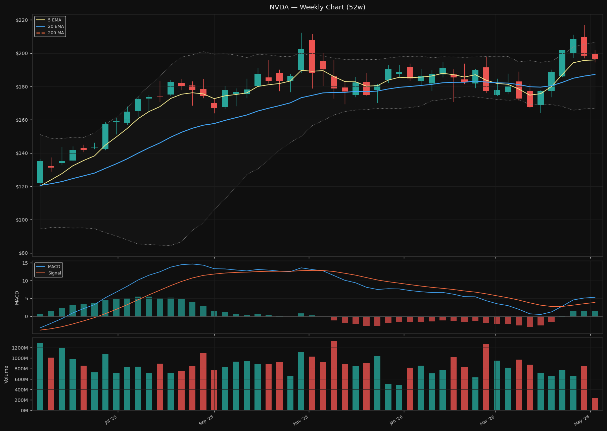

Price $196.50 · 5EMA $195.92 · 20EMA $187.19 · 200MA n/a (insufficient weekly history in dataset)
RSI 52.8 (neutral — room to run) · MACD: above signal line (bullish)
BB position: 75% (upper half, not yet extended) · ATR $14.6 (normal weekly range)
Price is tight to 5 EMA, comfortably above 20 EMA — momentum structure intact. 9.4% off 52-week high of $216.83, which is the key overhead resistance.

#### News (last 48h)
- *Wall Street Just Piled Into AMD: Eight Firms Hike Price Targets After Q1 Earnings Crusher* — Yahoo Finance, today
- *Stock Market Today: Dow Jumps 600 Points On U.S.-Iran Deal Hopes* — Yahoo Finance, today
- No NVDA-specific news surfaced; RSS feed returned broad market headlines. NVDA news may lag — check earnings calendar separately.

#### Risk Flags
ℹ Earnings date not returned by yfinance — check manually (likely late May)
ℹ Beta 2.24 — moves roughly 2.2x the market in both directions
ℹ Short interest 1.0% of float (very low — no squeeze dynamic, but also no bearish hedge pressure)
⚠ Semis correlation cluster: falls alongside MU, SOXL, MRVL in any sector rotation event
⚠ 9.4% from 52-week high — the $216 level is overhead resistance from prior peak

#### Overall Picture
NVDA is in a technically healthy position — above both EMAs, RSI neutral, MACD constructive, not overextended. Fundamentally the forward P/E of 18x is reasonable for a company growing earnings at 96% YoY. The risk is that consensus already prices in continued AI capex; any softening in hyperscaler data centre spend guidance would reprice this quickly. The current macro tailwind (semis sector recovery, risk-on market) is the best possible backdrop. Key level to watch: $216 — a clean break above that opens the prior ATH range.

---

### MU — Micron Technology, Inc.
**AI value chain** | Memory, HBM for AI

#### Macro Relevance
Memory is the most directly correlated play to AI infrastructure buildout after NVDA. SOXX outperforming SMH this week suggests broad semis strength, which benefits MU. Stable rates are neutral for capex-heavy memory fabs.

#### Fundamentals
Revenue growth +196% YoY (explosive AI memory demand) · Forward P/E 6.5x (very cheap for the growth rate) · PEG 0.20 (significantly undervalued on growth-adjusted basis)
Analyst target $551 (-16% from current $659 — this is notable: MU has run past consensus). High analyst target is $1,000. The stock has re-rated significantly faster than models expected. Gross margin 58%, operating margin 68%, FCF $2.9B.

#### Technical
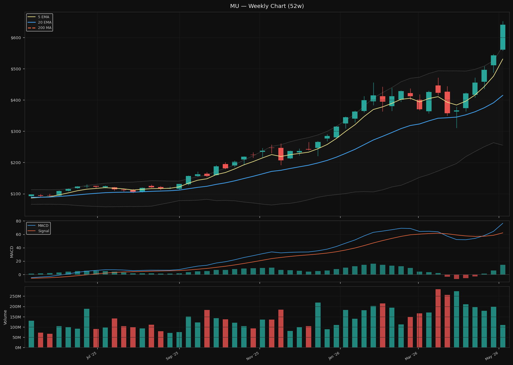

Price $640 · 5EMA $530 · 20EMA $414 · RSI 71.7 (overbought territory)
BB position: 122% — price has broken **above** the upper Bollinger Band. MACD above signal.
The stock has moved so fast that it has left all moving averages far behind. RSI at 71.7 on weekly candles is elevated. This is not a sell signal in a strong trend, but it does indicate the move is extended and a consolidation or pullback to the 5 EMA (~$530) would be technically normal and healthy.

#### News (last 48h)
- *Micron stock extends rally amid AI-driven memory demand* — Yahoo Finance, today
- *What Micron & Sandisk's stock moves say about the chip sector* — today
- *What's driving the rally in memory chip stocks?* — today
- *You Just Missed The SanDisk And Micron Memory Trade: These 10 Stocks Could Ride The Next AI Wave* — today
Strong news flow — multiple outlets covering the memory rally directly.

#### Risk Flags
⚠ RSI 71.7 on weekly — extended, elevated mean-reversion risk if sentiment shifts
⚠ Price 20.6% above 5 EMA, 54% above 20 EMA — very stretched from moving averages
⚠ Trading above analyst consensus mean ($551) — risk/reward from current price is asymmetric to the downside on fundamentals basis
ℹ Beta 1.92 · Short interest 3% (moderate — some sceptics remain)
⚠ Semis correlation cluster member

#### Overall Picture
MU is one of the most compelling fundamental stories in your portfolio — forward P/E of 6.5x for a company growing revenue 196% is genuinely cheap on a relative basis. The problem is that the stock already knows this: it's up massively, trading above analyst targets, RSI elevated, and far above all moving averages. The risk here isn't the fundamental thesis — it's timing and mean reversion. A healthy consolidation back toward $530-560 would reset the technical picture without breaking the trend. The question is whether you're comfortable holding through that if it comes, or would be better served trimming at extension and reloading lower.

---

### SOXL — Direxion Daily Semiconductor Bull 3X Shares
**AI value chain** | 3x leveraged semis ETF

#### Macro Relevance
SOXL is a pure momentum instrument on the semis sector. In the current environment — semis up 29-35% in a month — SOXL has done what it's designed to do. The question is always: where are we in the cycle?

#### Fundamentals
Not applicable — SOXL is an ETF, not a company. No meaningful fundamental metrics.
NAV tracks 3x daily returns of the ICE Semiconductor Index.

#### Technical
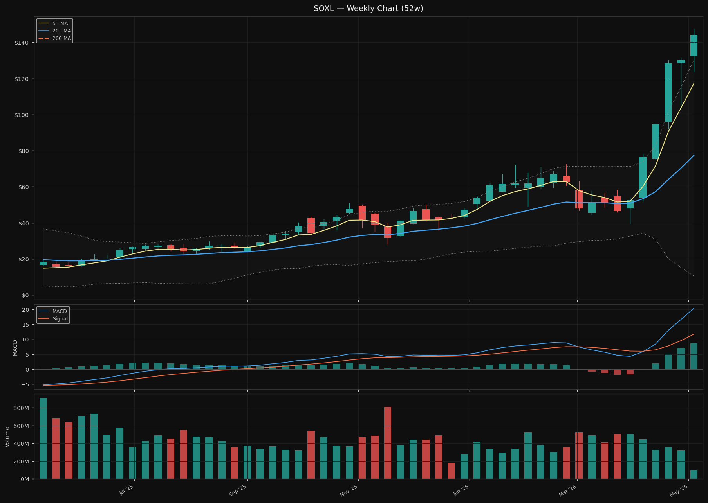

Price $144 · 5EMA $117 · 20EMA $77 · RSI 81.7 (overbought)
BB position: 112% — significantly above upper Bollinger Band. MACD above signal.
SOXL is 23% above its 5 EMA and 86% above its 20 EMA on weekly candles. RSI at 81.7 is the highest reading in your portfolio. This is a parabolic extension.

#### Risk Flags
⚠ **Leveraged ETF warning:** Daily 3x rebalancing causes volatility decay in choppy/sideways markets. This is not a long-term hold — it requires active monitoring and a clear directional view.
⚠ RSI 81.7 — most overbought reading across all 15 tickers
⚠ 112% BB position — price extended far above upper Bollinger Band
⚠ If semis sector reverses even 10-15%, SOXL could correct 30-45% from current levels
ℹ No fundamental floor — unlike individual stocks, no earnings or book value to anchor a drawdown

#### Overall Picture
SOXL is a short-duration momentum vehicle, not a position. At RSI 81.7 and 112% Bollinger Band, the instrument is at peak extension in the current move. If you're holding this, the critical question is: what is your exit thesis? In the absence of coach guidance today, the data alone says this is not a place to add; it's a place to define your stop or target. The underlying trend is real (semis recovery), but the 3x leverage means any sector consolidation hits disproportionately hard.

---

### MRVL — Marvell Technology, Inc.
**AI value chain** | Custom silicon, networking

#### Macro Relevance
MRVL is a direct beneficiary of AI networking buildout (custom ASICs, PCIe switches). Strong semis sector tailwind applies directly. USD weakness is marginally positive for international revenues.

#### Fundamentals
Revenue growth +22% YoY · Earnings growth +106% · Forward P/E 31x
Gross margin 51%, operating margin 19% (lower than NVDA — custom silicon is more complex to manufacture). D/E 33x is elevated. Analyst target $130 (-23% from current $169 — like MU, MRVL has run past consensus). Strong Buy from 39 analysts.

#### Technical
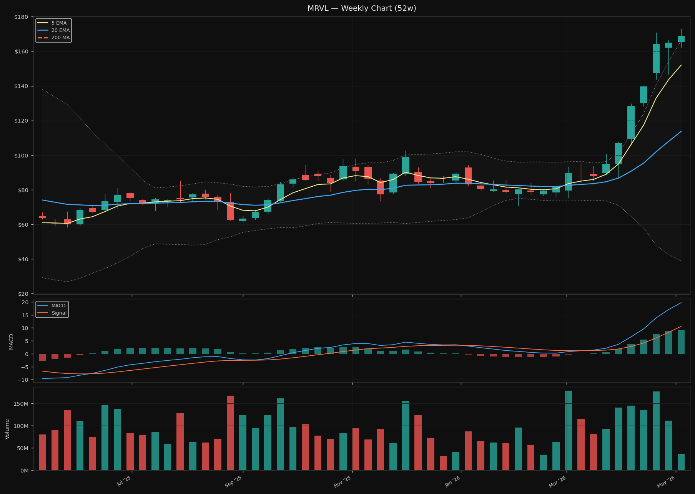

Price $169 · 5EMA $152 · 20EMA $114 · RSI 96.5 (**extreme** — highest meaningful RSI reading in the portfolio)
BB position: 102% — above upper Bollinger Band. MACD above signal.
RSI of 96.5 on weekly candles is a rare extreme reading. This does not mean the stock must fall immediately, but it does mean nearly all short-term sellers have already sold and nearly all momentum buyers are already in. The move from $58 (52-week low) to $169 is a 3x in one year.

#### News (last 48h)
- *Wilson Asset Management International purchases 22,837 shares of MRVL* — MarketBeat, today
- *S Bank Fund Management acquires MRVL shares* — MarketBeat, today
- *Swedbank sells 701,812 shares of MRVL* — MarketBeat, today
Institutional flows mixed — buying and selling at elevated prices. The Swedbank sale is notable size.

#### Risk Flags
⚠ RSI 96.5 — extreme overbought on weekly timeframe
⚠ Trading 23% above analyst consensus target
⚠ Swedbank sold 701K shares this week — significant institutional distribution
⚠ Semis correlation cluster member
ℹ Beta 2.25 · Short interest 4%

#### Overall Picture
MRVL's custom silicon thesis for AI infrastructure is sound and the earnings growth story (+106%) is real. But at RSI 96.5 with the stock 23% above analyst targets and institutional selling visible in the news feed, the risk/reward profile at current levels is unfavourable for new exposure. For existing holders, the question is position sizing relative to your total AI value chain concentration. Given you also hold NVDA, MU, and SOXL in the same cluster, MRVL adds correlated risk rather than diversification. A pullback to the 5 EMA (~$152) or 20 EMA (~$114) would offer a more rational entry or add opportunity.

---

### APH — Amphenol Corporation
**AI value chain** | Connectors/interconnects for AI infra

#### Macro Relevance
Amphenol is the picks-and-shovels play in AI infrastructure — every GPU cluster, server rack, and data centre interconnect uses their connectors. Less volatile than pure-play semis, benefits from the same capex cycle with steadier revenue.

#### Fundamentals
Revenue growth +58% YoY · Earnings growth +24% · Forward P/E 25x · PEG 1.21 (fairly valued)
Gross margin 38%, operating margin 27%. Analyst target $182 (+31% upside, 18 analysts, Buy). FCF $3.6B. D/E 133x looks alarming but is typical for an acquisitive industrial company — current ratio 1.71 is fine.

#### Technical
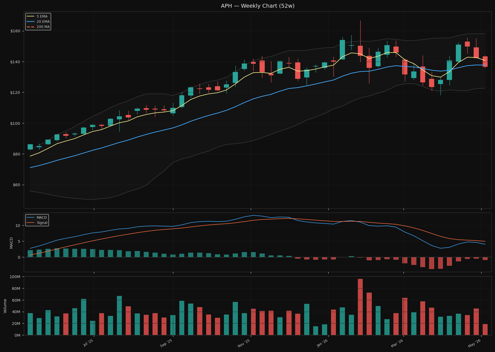

Price $137 · 5EMA $141 · 20EMA $138 · RSI 46.3 (neutral-weak)
BB position: 40% (lower half of Bollinger Band) · MACD: below signal (bearish crossover)
APH is the only holding where price is **below** both the 5 EMA and 20 EMA. MACD is in a bearish cross. The stock is 18% off its 52-week high of $167. This is a technically weak picture relative to the broad semis rally — APH is underperforming its sector peers right now.

#### News (last 48h)
- *Amphenol prices €1.1B Euro Senior Notes offering* — TipRanks/Stock Titan, today
- *Indivisible Partners takes $9.47M position in APH* — MarketBeat, today
- *Truist Financial increases holdings in APH* — MarketBeat, today
The €1.1B notes offering (debt issuance) is worth noting — they're raising capital, likely for M&A. This is consistent with their acquisition strategy but adds leverage near-term.

#### Risk Flags
⚠ Price below both 5 EMA and 20 EMA — technically in a short-term downtrend while broader semis rally
⚠ 18% drawdown from 52-week high — notable underperformance vs sector
⚠ €1.1B debt issuance announced this week — dilutive to near-term FCF, M&A-related
ℹ Beta 1.30 · Short interest 1% (very low)

#### Overall Picture
APH's fundamental business is strong and the AI infra thesis is intact. The technical underperformance is the notable signal here — while NVDA, MU, MRVL, and AMAT all participate in the semis recovery, APH is sitting below its moving averages. This divergence often resolves one of two ways: the stock catches up to sector strength, or it's flagging something specific to APH (the debt issuance is one candidate). The 31% upside to analyst consensus and low short interest suggest no fundamental deterioration, but the technical picture warrants watching. The 20 EMA (~$138) is the key level — a weekly close above it would confirm it's just lagging, not breaking.

---

### VST — Vistra Corp.
**AI value chain** | Power/energy for data centres

#### Macro Relevance
VST is the energy infrastructure play on AI — data centres need massive power, and Vistra operates gas and nuclear plants. Less correlated to the semis cycle than your other AI holdings; more sensitive to energy prices, regulation, and power demand projections. Stable rates are marginally positive (reduces financing costs on their heavy capex).

#### Fundamentals
Forward P/E 14x · Analyst target $228 (+45% upside — the highest upside in your portfolio, 19 analysts, Strong Buy)
Trailing earnings distorted by non-cash items — the forward picture is what matters here. Revenue growth 14% YoY, FCF slightly negative (-$0.46B) due to power plant capex. D/E 400x reflects the utility capital structure, not financial distress.

#### Technical
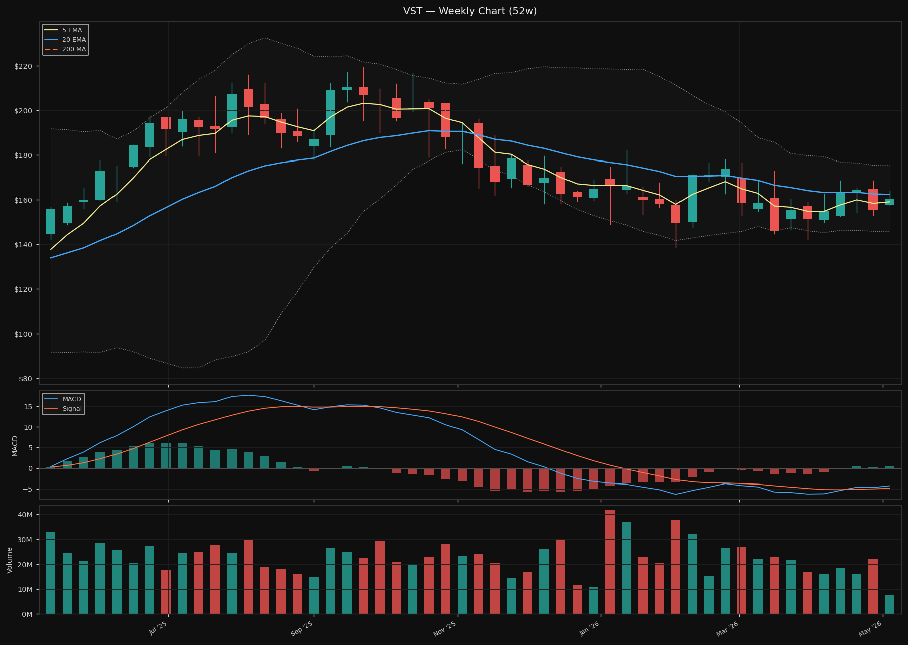

Price $160 · 5EMA $159 · 20EMA $162 · RSI 51.1 (neutral)
BB position: 50% (dead centre of Bollinger Band) · MACD: marginally above signal
VST is coiling — price is between the 5 EMA and 20 EMA, RSI neutral, BB mid-band. The stock is 27% off its 52-week high of $219. This is consolidation after a significant drawdown.

#### News (last 48h)
- *All Eyes on Vistra's Q1 Earnings: What Lies Ahead for the Stock?* — Zacks, today
- *Why Vistra (VST) Is Gaining From AI-Driven Power Demand* — Yahoo Finance, today
- *Atomic Dividends: Big Tech's New Energy Bet* — MarketBeat, today
Q1 earnings are imminent — the Zacks article explicitly previews them. This is the near-term catalyst.

#### Risk Flags
⚠ **Earnings imminent** — Q1 results coming shortly. VST at 50% BB mid-band is exactly where stocks go before a catalyst resolves direction.
⚠ 27% drawdown from 52-week high — significant gap to recover
⚠ FCF negative — capital-intensive capex cycle ongoing
ℹ Beta 1.45 · Short interest 4%

#### Overall Picture
VST has the highest analyst upside in your portfolio (45%) and the cleanest near-term catalyst (Q1 earnings). The technical setup is a coil — neutral RSI, price between the two EMAs, mid-Bollinger. This is a stock waiting for a trigger. The power-demand-for-AI narrative remains structurally intact (the news flow confirms it). The question coming into earnings is whether actual power contract bookings and forward guidance justify the re-rating to $228 consensus. A strong Q1 with raised guidance could be the move that breaks VST out of this 27% drawdown range.

---

### MO — Altria Group, Inc.
**Defensive** | Tobacco, dividend yield

#### Macro Relevance
MO is a counter-cyclical hold — it tends to underperform in risk-on markets (like today's) but provides ballast when the AI trade rotates. Stable rates (4.35%) are slightly positive for dividend-paying defensives.

#### Fundamentals
P/E 15x · Forward P/E 12x · Dividend yield (reported as 582% by yfinance — this is a data artefact, likely restated; actual yield is approximately 7.5-8%, which is the known Altria yield)
Revenue growth +5.3% · Earnings growth +106% (benefiting from Juul/oral nicotine reclassification) · Gross margin 87% · Operating margin 62% — exceptional margins for any business. FCF $8.5B. Analyst target $69 (-2.5% from $71 current — stock is at/above consensus).

#### Technical
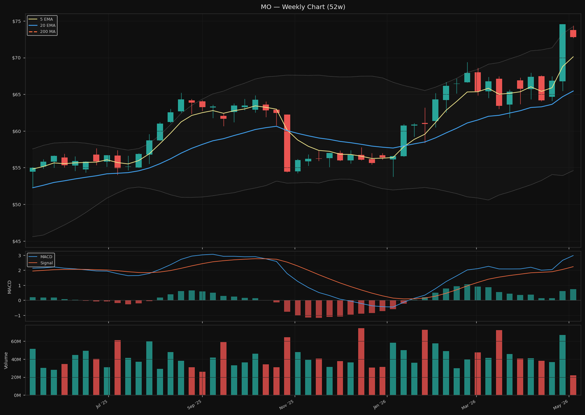

Price $73 · 5EMA $70 · 20EMA $65 · RSI 67.7 (approaching overbought)
BB position: 93% (near top of Bollinger Band) · MACD: above signal
MO is near the top of its Bollinger Band and approaching its 52-week high of $74.56. The stock is in a clean uptrend — above both EMAs.

#### News (last 48h)
- *Why Altria (MO) Is Up 7.4% After Strong Q1 Earnings And Rising Oral Nicotine Sales* — today
- *Altria Group, Inc. (MO) Is a Trending Stock* — Yahoo Finance, today
- *These 3 Dividend Stocks Have Raised Their Payouts for a Combined 187 Years* — today
Q1 earnings beat is the driver — oral nicotine (on! pouches) is growing and partially offsetting cigarette volume declines. This is the positive catalyst that explains the move to 93% BB.

#### Risk Flags
⚠ Trading at/above analyst consensus target ($69) — limited further upside priced in by street models
⚠ BB position 93% — extended near-term, pullback to 5 EMA ($70) would be normal
ℹ Beta 0.52 (very low — defensive as expected)
ℹ Short interest 3%

#### Overall Picture
MO delivered a clean Q1 beat driven by oral nicotine growth, and the stock has responded. At $73, you're near the 52-week high and above analyst consensus. This is not a problem for a yield-based holding — you're holding MO for the dividend and the defensive ballast, not for capital appreciation. The technical strength is a bonus. The structural risk remains the long-term decline of combustibles volume, offset by the oral nicotine category. Nothing in today's data suggests the thesis has changed.

---

### WMT — Walmart Inc.
**Defensive** | Retail, consumer staples

#### Macro Relevance
WMT benefits from mild USD weakness (international revenues, Flipkart). Consumer spending data has been resilient — positive for WMT. Less sensitive to rate moves than tech.

#### Fundamentals
Revenue growth +5.6% · Forward P/E 40x (premium valuation for a retailer — priced for consistent execution)
Gross margin 25%, profit margin 3.1% — thin as expected for retail. FCF $10.6B. Analyst target $137 (+5% upside, 41 analysts, Strong Buy). The 40x forward P/E prices in continued e-commerce + advertising revenue mix shift.

#### Technical
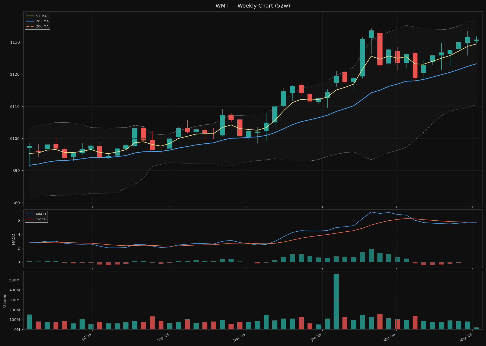

Price $131 · 5EMA $129 · 20EMA $123 · RSI 60.2 (neutral-positive)
BB position: 77% · MACD: below signal (mild weakness)
WMT is above both EMAs with RSI at 60 — technically healthy but not extended. The MACD is slightly below signal, which is the only minor negative. 2.7% off 52-week high.

#### News (last 48h)
- *Maryland moving to ban surveillance pricing at retailers like Walmart* — today
- *1 Dividend Stock to Hold for the Next 10 Years* — today
- *Walmart Has Rewarded Patient Investors: A Prospective Dividend King's Long-Term Payoff* — today
Surveillance pricing legislation is worth monitoring — if passed, it could limit dynamic pricing capabilities. Still early stage.

#### Risk Flags
ℹ Beta 0.65 (low — defensive as expected)
ℹ Short interest 2%
ℹ Forward P/E 40x — premium for a retailer, requires consistent execution to maintain
ℹ Surveillance pricing legislation in Maryland — regulatory risk, nascent

#### Overall Picture
WMT is doing what a defensive holding should do — steady uptrend, low volatility, near all-time highs, modest analyst upside. No flags here. The premium valuation is the structural risk to monitor over time (any guidance miss re-rates it sharply), but in the current environment it's simply performing its role in the portfolio.

---

### PDD — PDD Holdings Inc.
**Defensive** | China e-commerce (Temu/Pinduoduo)

#### Macro Relevance
PDD is the outlier in your defensive bucket — it has China-specific geopolitical risk that is independent of US macro. Mild USD weakness is a marginal positive. The broader risk-on environment helps, but PDD trades more on China/US trade policy news than on US equity market flows.

#### Fundamentals
P/E 10.5x · Forward P/E 7.2x · PEG 0.70 — deeply discounted valuation for a profitable, high-growth company. Revenue growth +12% YoY (decelerating from prior hyper-growth). FCF $85.6B (very high — asset-light model). Analyst target $143 (+40% upside, 33 analysts, Buy). D/E 1.3x — clean balance sheet.

#### Technical
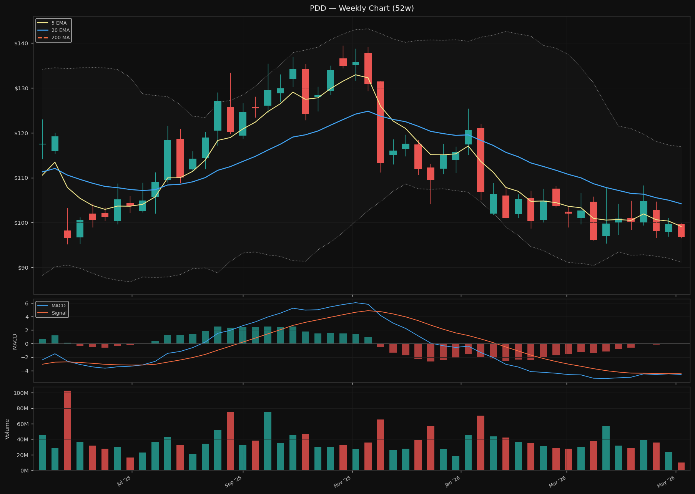

Price $97 · 5EMA $99 · 20EMA $104 · RSI 45.3 (neutral-weak)
BB position: 22% (lower portion of Bollinger Band) · MACD: below signal
PDD is the weakest technical picture in your holdings — below both EMAs, RSI below 50, MACD in bearish territory, trading near the bottom of its Bollinger Band. The stock is 30.6% off its 52-week high and only 1.6% above its 52-week **low** of $95.24.

#### News (last 48h)
- *PDD Holdings Dips More Than Broader Market: What You Should Know* — Yahoo Finance, today (x2)
- *3 Absurdly Cheap Growth Stocks to Buy in May 2026 — includes PDD* — Motley Fool, today
- *PDD Holdings is Attracting Investor Attention* — today
The "dips more than broader market" headline on a day when the market is up 600 points is telling — PDD is diverging negatively from the broad rally.

#### Risk Flags
⚠ **Near 52-week low** — $95.24 is the low, current price $97 is 1.6% above it. This is a critical support level.
⚠ 30.6% drawdown from 52-week high — significant underwater position
⚠ Negative price action on a strongly up market day — a notable divergence
⚠ **Geopolitical flag:** China-listed ADR exposed to US-China trade policy, potential delisting risk, Temu regulatory scrutiny in Western markets
ℹ Beta 0.03 (essentially uncorrelated to US market — this is by design, but it means it doesn't benefit from US risk-on rallies either)
ℹ Short interest 3%

#### Overall Picture
PDD presents the sharpest contrast in your portfolio today. Fundamentally, it's one of the cheapest stocks you hold — P/E 10x, FCF $85B, 40% upside to analyst consensus. But the market is discounting these fundamentals heavily, and today's negative divergence (falling while the market rallies 600 points) suggests the discount is about geopolitical risk and investor avoidance, not fundamentals. The $95 level is the line in the sand — a break below that is a new 52-week low on a stock already down 30% from its high, which would be a structurally bearish signal regardless of how cheap it looks on paper. This requires coach guidance context — whether the China macro/policy environment has changed.

---

### DAL — Delta Air Lines, Inc.
**Defensive** | Airlines, macro/fuel sensitive

#### Macro Relevance
Today's catalyst is directly relevant: the Dow is up 600 points partly on US-Iran deal hopes, which would reduce geopolitical risk and stabilise oil prices. Airlines are direct beneficiaries — lower oil = lower fuel cost = margin expansion.

#### Fundamentals
P/E 10.7x · Forward P/E 9.2x · PEG 0.21 — extremely cheap relative to growth. Revenue growth +13% · FCF $3.1B. Analyst target $79 (+8% upside, 25 analysts, Strong Buy). Airline economics: thin margins (profit margin 7%), but DAL is the highest-quality operator in the sector.

#### Technical
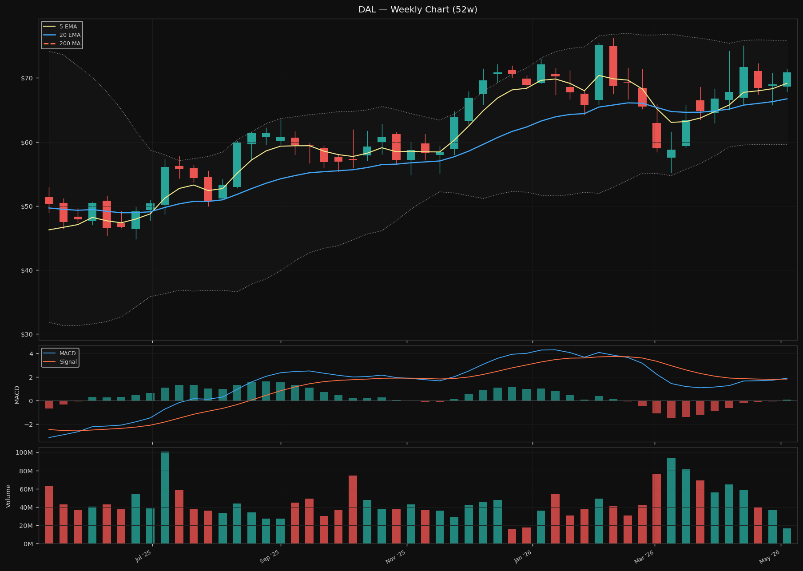

Price $71 · 5EMA $69 · 20EMA $67 · RSI 55.7 (neutral)
BB position: 69% · **MACD: bullish crossover** (the only ticker in your portfolio with a fresh MACD bullish cross today)
DAL is above both EMAs, RSI neutral, MACD just crossed bullishly — a technically constructive setup reinforced by today's Iran news catalyst.

#### News (last 48h)
- *Airline shares jump as optimism grows over possible U.S.-Iran agreement* — today
- *Is It Too Late To Consider Delta Air Lines After A 60% One Year Rally?* — Yahoo Finance, today
- *Delta is killing food and beverage service on hundreds of daily flights unless you splurge* — today (operational/brand)
- *Why Delta Air Lines Stock Is Under Pressure Now* — TipRanks, today (prior to Iran news)
The Iran deal headline is the dominant driver today. The 60% one-year rally article is worth reading.

#### Risk Flags
ℹ Beta 1.25 · Short interest 4%
ℹ Current ratio 0.42 — airline balance sheets always look weak here due to advance ticket liabilities; not a distress signal for DAL specifically
ℹ Fuel price sensitivity — if Iran deal falls through or oil spikes, this reverses quickly
ℹ 7% below 52-week high

#### Overall Picture
DAL has a clean technical setup today with a fresh MACD bullish cross, above its EMAs, and a direct macro catalyst (Iran deal hopes reducing oil risk). The 9x forward P/E is cheap for an airline with DAL's quality. The risk is that airline stocks are sensitive to macro events that can reverse quickly (geopolitical flare-ups, oil spikes, demand softening). The today-specific catalyst is positive but event-driven — the picture could look different if the Iran deal fails to materialise. For a longer-term hold, the structural story (DAL's premium positioning, loyalty program, domestic dominance) remains intact.

---

## Watchlist

---

### SNDK — Sandisk Corporation
**AI value chain** | Flash storage, Western Digital spinoff

#### Macro Relevance
SNDK is the recently-spun-off flash storage business from WD. Memory sector tailwind (same as MU) applies directly. New public company — limited history, high institutional attention as a fresh spin.

#### Fundamentals
Revenue growth +251% YoY (WD consolidation effect from spin) · Forward P/E 8.3x · Gross margin 56% · Analyst target $1,348 (-3.5% from $1,397 current — stock has run past consensus, 22 analysts, Buy). FCF $2.3B. Clean balance sheet: D/E 1.5x, current ratio 4.78.

#### Technical
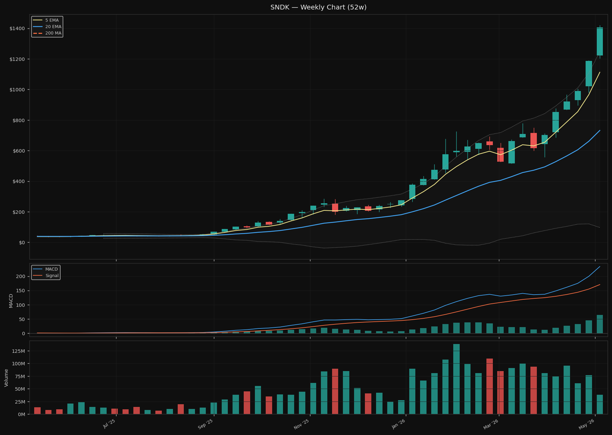

Price $1,406 · 5EMA $1,112 · 20EMA $732 · RSI 82.9 (overbought)
BB position: 114% — significantly above upper Bollinger Band.
SNDK is in the same parabolic extension camp as MU and MRVL. 26.4% above 5 EMA, 92% above 20 EMA, RSI 83. Short interest is 10% — there is a meaningful short position against this rally.

#### News (last 48h)
- *What Micron & Sandisk's stock moves say about the chip sector* — today
- *Sandisk: The Steepest Margin Expansion In NAND History Has Only One Way To Go* — Seeking Alpha, today
- *Sandisk (SNDK): Best Young Stocks to Buy and Hold for the Next Decade* — Yahoo Finance, today
- *WD Announces Equity-for-Equity Exchange* — today (related to the WD/SNDK restructuring)
The Seeking Alpha article title is notable — "steepest margin expansion in NAND history has only one way to go" is a bearish framing of the elevated multiple.

#### Risk Flags
⚠ RSI 82.9 — overbought on weekly timeframe
⚠ 10% short interest — meaningful short position, squeeze risk but also informed bearish positioning
⚠ Trading above analyst consensus — street hasn't caught up to price
⚠ New spinoff — limited track record as independent public company, higher uncertainty
⚠ Correlation cluster with MU — both move on NAND/HBM sentiment

#### Entry Consideration
The SNDK thesis (NAND flash for AI storage, margin expansion, clean balance sheet post-spin) is compelling. However, at RSI 83 and 114% Bollinger Band, entering here means chasing a move that has already happened. The more rational entry window would be on a pullback to the 5 EMA (~$1,112) or better, the 20 EMA (~$732), where the risk/reward for a new position would be structurally better. The 10% short interest creates a squeeze dynamic that could keep the stock elevated longer than technicals suggest — but also means a violent reversal is possible if the short thesis (margin compression, competition from SK Hynix/Samsung) gains traction.

---

### AMAT — Applied Materials, Inc.
**AI value chain** | Semiconductor equipment

#### Macro Relevance
AMAT is a leading indicator for the semis capex cycle — before chips are made, fabs buy AMAT equipment. Strong semis rally and AI capex buildout are directly positive. Export controls on China (AMAT's largest market) remain the structural overhang.

#### Fundamentals
Revenue growth -2.1% YoY (slight decline — equipment cycle lag behind demand) · Earnings growth +75% (margin improvement) · Forward P/E 30x · Analyst target $424 (flat to current, 32 analysts, Buy). FCF $4.3B. Gross margin 49%.

#### Technical
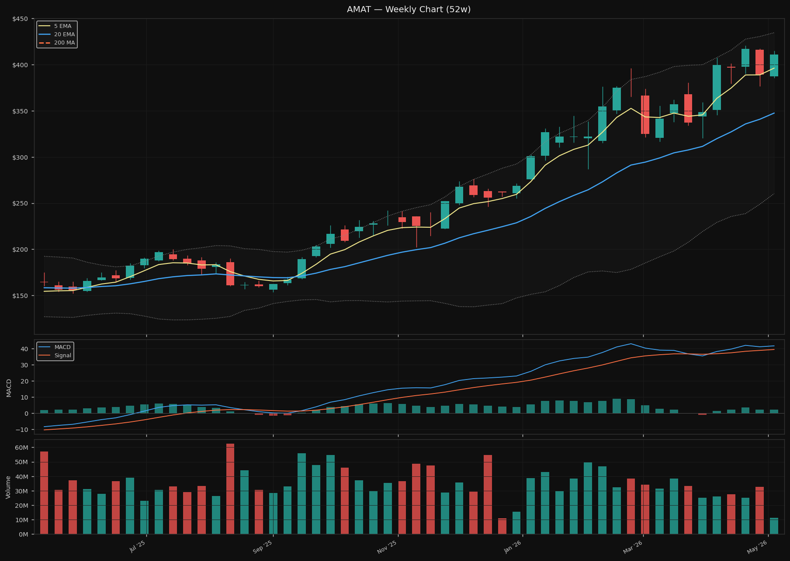

Price $411 · 5EMA $396 · 20EMA $347 · RSI 65.3 (elevated but not extreme)
BB position: 86% · MACD: above signal
AMAT has broken above its 20-day moving average (the news confirms this: "Applied Materials Just Overtook the 20-Day Moving Average"). RSI 65 is elevated but not in the extreme territory of MU/MRVL/SNDK. This is a cleaner setup than the most extended names.

#### News (last 48h)
- *Applied Materials Just Overtook the 20-Day Moving Average* — Zacks, today (x2)
- *Applied Materials CEO, CFO set May-June investor webcasts* — Stock Titan, today
- *AMAT Stock at P/S of 9.39x: Should You Buy, Sell or Hold?* — Zacks, today
The 20 MA breakout is a genuine technical event. Investor webcasts in May-June could be a near-term catalyst.

#### Risk Flags
⚠ Revenue growth slightly negative — equipment cycle lagging chip demand; this should reverse but timing uncertain
⚠ China export control risk — ongoing structural overhang on largest market
ℹ Beta 1.65 · Short interest 2% (low)
ℹ Analyst target roughly at current price — consensus doesn't see major near-term upside from here

#### Entry Consideration
AMAT's recent 20 EMA breakout is the most technically constructive setup among your watchlist names — RSI 65 (elevated but not extreme), clean MA breakout, above-signal MACD, and upcoming investor events as a catalyst. The fundamental challenge is the slight revenue decline (equipment cycle lag), but earnings growth of 75% shows margin improvement. Compared to SNDK/MU/MRVL which are all at RSI 80+, AMAT offers a more measured entry point. A pullback to the 20 EMA (~$347) would be ideal, but the current setup is not as stretched as the rest of the watchlist.

---

### LITE — Lumentum Holdings Inc.
**AI value chain** | Optical components for AI networking

#### Macro Relevance
Lumentum makes optical components (lasers, transceivers) for the high-speed interconnects inside AI data centres. Direct beneficiary of hyperscaler AI capex. Joined the S&P 500 recently — passive buying tailwind.

#### Fundamentals
Revenue growth +65% YoY · Forward P/E 55x (expensive) · Gross margin 37% (lower than semis peers) · Analyst target $905 (-2% from $994 current — stock above consensus). 24 analysts, Buy. FCF slightly negative.

#### Technical
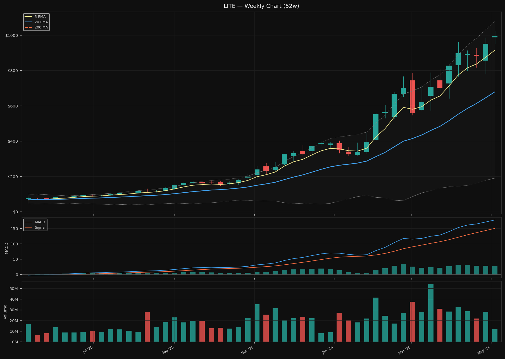

Price $994 · 5EMA $914 · 20EMA $678 · RSI 82.5 (overbought)
BB position: 90% · MACD: above signal
LITE is in the same extended camp as MU, MRVL, SNDK. 9% above 5 EMA, 47% above 20 EMA, RSI 82.5.

#### News (last 48h)
- *Lumentum Q3 2026 Earnings Transcript* — today
- *Lumentum Earnings Beat Estimates. Why the Stock Is Dropping.* — Barron's, today
- *Barclays Boosts Lumentum Price Target to $1,000* — MarketBeat, today
- *BNP Paribas: Stock Price Expected to Rise* — MarketBeat, today
- *Lumentum Price Target Raised to $1,130* — MarketBeat, today
**Key: Earnings just reported — beat on estimates but stock is dropping.** This is a classic "sell the news" reaction. Multiple analyst target raises ($1,000-$1,130) suggest the business is performing, but the price action post-earnings is telling.

#### Risk Flags
⚠ **Stock dropping after earnings beat** — "sell the news" dynamic, elevated expectations already priced in
⚠ RSI 82.5 — overbought heading into post-earnings digestion
⚠ Trading above analyst consensus; $1,130 high target
⚠ FCF slightly negative — still in investment mode
ℹ Debt/equity 392x — significant leverage, typical for optics companies with heavy capex

#### Entry Consideration
LITE's post-earnings "drop on beat" is a warning flag for new entrants. When a stock falls on good earnings, it means the good news was already priced in and investors are rotating out. Given the RSI is already 82.5 and the price is above analyst consensus, adding LITE here carries significant mean-reversion risk in the near term. The earnings beat confirms the business is strong; the entry question is price. A reset toward the 5 EMA ($914) or lower would offer a better risk/reward. Monitor the price action over the next 1-2 weeks to see if the post-earnings selling exhausts itself.

---

### COHR — Coherent Corp.
**AI value chain** | Optical/laser components

#### Macro Relevance
Coherent is a direct LITE competitor/complement — optical transceivers for AI data centre interconnects. Same sector tailwind applies. Often moves in tandem with LITE.

#### Fundamentals
Revenue growth +17.5% YoY · Forward P/E 45x · Earnings growth +73% · PEG 0.92 (reasonable for the growth rate)
Gross margin 36%, profit margin 4.7% — thin current profitability but improving rapidly. Analyst target $327 (-4% from $341 current, 21 analysts, Buy). FCF $130M.

#### Technical
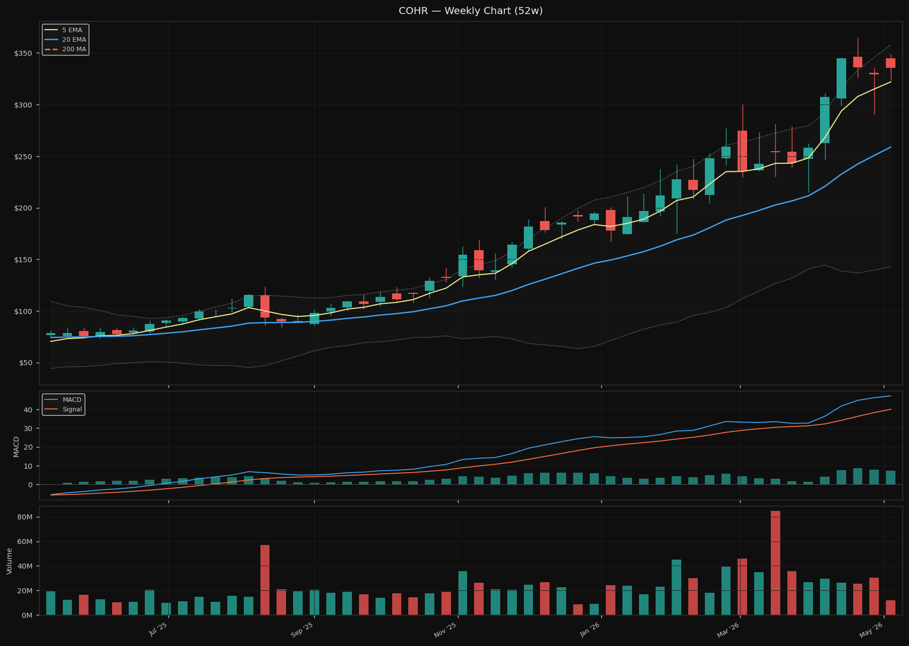

Price $336 · 5EMA $322 · 20EMA $259 · RSI 75.5 (overbought)
BB position: 90% · MACD: above signal
Similar to LITE — elevated RSI, high BB position. The stock is 8% off its 52-week high.

#### News (last 48h)
- *Nvidia Stock Falls Behind as Big Tech Rivals Enter Its Territory* — today
- *Between Amphenol and Coherent, Which Stock Looks Set to Break Out?* — Trefis, today
- *Can Amphenol Outrun Coherent in the Next Rally?* — Trefis, today
- *Is It Too Late To Consider Coherent After Its Recent Share Price Surge?* — SimplyWall St, today
The Trefis articles directly compare COHR to APH (which you hold) — worth reading for positioning context.

#### Risk Flags
⚠ RSI 75.5 — overbought
⚠ Thin current profitability (4.7% profit margin) — earnings leverage is forward-looking, not current
⚠ Trading above analyst consensus
ℹ Beta 2.05 · Short interest 6% (moderate bearish positioning)

#### Entry Consideration
COHR and LITE are similar businesses in the optical components space — if you were to add one, the earnings event and post-earnings price action at LITE is a more informative signal right now. COHR has a cleaner chart (RSI 75 vs LITE's 82) but no fresh catalyst. The 6% short interest suggests informed sceptics exist. If the optical AI theme continues (which the LITE earnings beat suggests it should), COHR at a pullback to the 5 EMA (~$322) or 20 EMA (~$259) is the more rational entry window. The Trefis APH vs COHR comparison is relevant given your existing APH holding — they serve overlapping markets with different risk profiles.

---

### AAOI — Applied Optoelectronics, Inc.
**AI value chain** | Optical transceivers, high beta

#### Macro Relevance
Smallest and highest-beta name in your watchlist. Pure-play optical transceiver maker for data centres. Beneficiary of same AI networking capex, but with much higher execution and balance sheet risk than COHR or LITE.

#### Fundamentals
Currently loss-making (EPS -$0.63 trailing) · Forward P/E 55x (pricing in a significant turnaround) · Revenue growth +34% · Analyst target $102 (-41% from current $175 — stock has dramatically outrun analyst models, only 5 analysts cover it)
Gross margin 30% (lowest in the optical group) · FCF -$380M · D/E 34x · ROE -7.9%

#### Technical
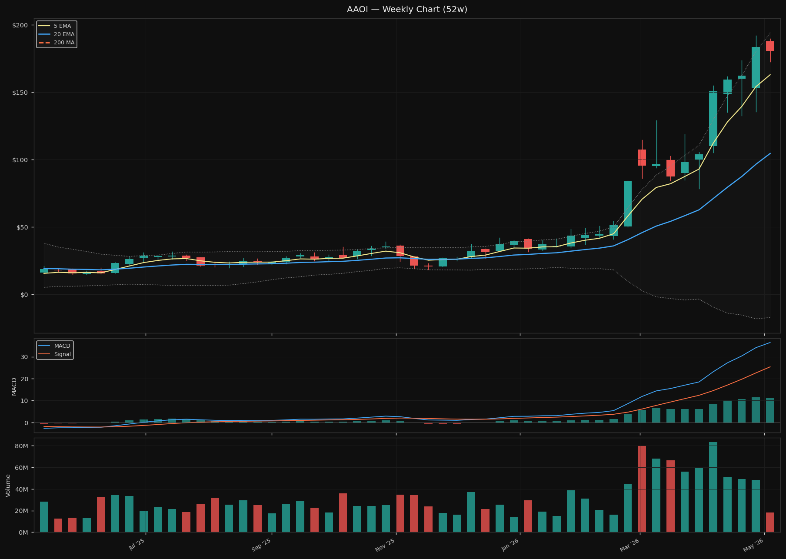

Price $181 · 5EMA $163 · 20EMA $105 · RSI 92.4 (extreme — second highest in portfolio after MRVL)
BB position: 94% · MACD: above signal
AAOI is up 1,099% from its 52-week low. RSI 92.4 on weekly candles is an extreme reading. The stock has entered parabolic territory.

#### News (last 48h)
- *AAOI Stock Before Q1 Earnings: Smart Buy or Risky Move?* — Yahoo Finance/TradingView, today (x3)
- *These 3 Telecom Stocks Rallied Over 1,000% In A Year: Nvidia Did 75%* — Benzinga, today
- *Assessing AAOI Valuation After Texas Grant Backs AI Transceiver Manufacturing* — today
- *Average Rating of "Hold" from Brokerages* — MarketBeat, today
**Q1 earnings are imminent.** Three separate articles today asking whether it's a "smart buy or risky move" before earnings. The Texas manufacturing grant is a positive catalyst. Hold-rated by brokerages despite 1,000% move.

#### Risk Flags
⚠ RSI 92.4 — extreme overbought
⚠ Stock -41% below analyst consensus target (target of $102 vs price of $181) — street is far behind or sees significant downside risk
⚠ Q1 earnings imminent — binary event for a momentum stock at these levels
⚠ Currently loss-making — no earnings floor
⚠ Beta 3.76 (highest in your portfolio — maximum volatility exposure)
⚠ 13% short interest — significant informed bearish positioning
⚠ Negative FCF, thin margins, highest leverage relative to the optical group

#### Entry Consideration
AAOI is a speculation, not an investment — currently loss-making, 13% short interest, RSI 92, price 41% above where analysts think fair value is, with earnings about to print. The Texas grant story and the AI optical tailwind are real, but this is a stock where the narrative has run far ahead of the fundamentals. The risk/reward for a new entry here is deeply unfavourable: limited upside (already above all targets), significant downside if earnings disappoint or momentum breaks. If you want optical transceiver exposure, COHR or LITE offer the same theme with far better fundamental underpinning and less speculative positioning. AAOI as a watch-only until post-earnings price action clarifies the picture.

---

## Appendix: Raw Data Reference
- Fundamentals: `data/2026-05-06/fundamentals.json`
- Technical: `data/2026-05-06/technical.json`
- News: `data/2026-05-06/news.json`
- Risk: `data/2026-05-06/risk.json`
- Coach guidance: not provided this session
