# Daily Research Brief — 2026-05-08

## Session Summary

### Macro Environment

The macro backdrop is unambiguously risk-on entering May 8. VIX sits at 17.47, below both the 20 EMA (18.84) and 50 MA (22.10), having compressed 10.4% over the past month — the market is pricing low volatility. SPY at $733.69 is 3.4% above its 20 EMA with MoM gains of 7.9%, confirming the broad bull trend. The standout signal is semis: SMH is 11.2% above its 20 EMA (+26.4% MoM) and SOXX is 12.0% above its 20 EMA (+30.9% MoM) — both tracking nearly identically, meaning the rally is sector-wide and not just an NVDA distortion. The 10-year yield (TNX) is 4.38%, essentially flat WoW and barely above its 20 EMA (4.35%) — rates are stable and not a near-term headwind. The Dollar Index (DXY) is 97.98, slightly below its 20 EMA (98.49), which is mildly tailwind for multinationals with international revenue (WMT, PDD).

- VIX: 17.47 (low) · WoW: +2.8% (modest uptick from last week's low)
- SPY: $733.69 · above 20 EMA $709.45 (+3.4%) · MoM +7.9% — bull trend intact
- SMH: $544.10 · above 20 EMA $489.39 (+11.2%) · MoM +26.4%
- SOXX: $495.49 · above 20 EMA $442.29 (+12.0%) · MoM +30.9% — SMH and SOXX tracking together; rally is broad, not NVDA-specific
- TNX: 4.38% · stable, near EMA20 — not a headwind
- DXY: 97.98 · below EMA20 — slight tailwind for multinationals

### Watch Items from Previous Session

No carry-forward watch items for today's session — this is the first real session.

---

### Coach Guidance Summary

Three notes from ZJJ and Joe on the evening of May 7. The core message is: **hold positions before the US-China summit, the macro backdrop is improving, and capital will ultimately rotate back to AI hardware after its current diffusion into software and non-core names.**

ZJJ's first note (19:52) lays out the SK Securities thesis that storage has structurally transitioned from a "Book frame" (PB-based) valuation model to an "Earnings frame" (PE-based) — the LTA/Dual market structure and HBM's stability during the 2025 commodity DRAM correction are the hard evidence. ZJJ's second note (22:45) provides the actionable read for this session: risk-off risk is minimal before the US-China summit, capital is diffusing (software/gold up, storage/optical modules dipping), but capital will return to AI hardware. Exit discipline is the focus — valid breaks of moving averages require volume confirmation. Joe's note (盘前) shows McDonald's beat drove software rotation; analysts have no strong view on whether software is AI-impaired; semis/storage/optical are "阶段稍弱" (near-term soft) waiting for the 30-day line to stabilise.

> 「某存储芯片龙头起来了，因为现在机构是在往里面配，基本上现在是每一次跌都有机构进来。」— ZJJ (22:45)

> 「整体市场在中美见面之前应该不会有什么太大的风险。」— ZJJ (22:45)

> 「最终资金还是会回到AI硬件、AI infra基建这一块。」— ZJJ (22:45)

Tickers mentioned (by reference): storage leaders (MU, SNDK context), optical modules (LITE, COHR context), semis broadly (SOXL, NVDA, MRVL context), power/liquid cooling (VST context), China tech (PDD adjacent via 中概龙)
Sectors flagged: Storage, Optical modules, AI hardware/infra, Software (rotation target, not sustainable), Power/Energy

---

## Holdings

---

### NVDA — NVIDIA Corporation
**Technology | Semiconductors** | Core AI GPU and CUDA platform

#### Coach Signal
> 「最终资金还是会回到AI硬件、AI infra基建这一块。」— ZJJ (22:45)
> 「半导体指数/存储/光通信阶段稍弱等待龙头30日线企稳信号是否出现」— Joe (盘前)

**Signal: Constructive (medium-term) / Neutral (near-term)**
The coach's view is that capital is temporarily in software but structurally returns to AI hardware — NVDA is the clearest beneficiary of that reversal. The "wait for semis leaders 30-day line stabilisation" note suggests the sector needs a bit more digestion before the next leg, but the direction is unchanged.

#### Macro Relevance
Semis sector up 26–31% MoM (SMH/SOXX both +11–12% above 20 EMA) — NVDA is the largest SMH component, so the macro tailwind is direct and strong. Stable rates (TNX 4.38%) support the multiple.

#### Fundamentals
P/E 43.6x · Fwd P/E 19.0x · Revenue growth +73.2% YoY · Gross margin 71.1% · Op margin 65.0%
Analyst target: $269 (+26.1% upside) · 57 analysts · Rec: Strong Buy · FCF $58.1B
PEG 0.66 — not expensive relative to growth rate at current multiples.

#### Technical
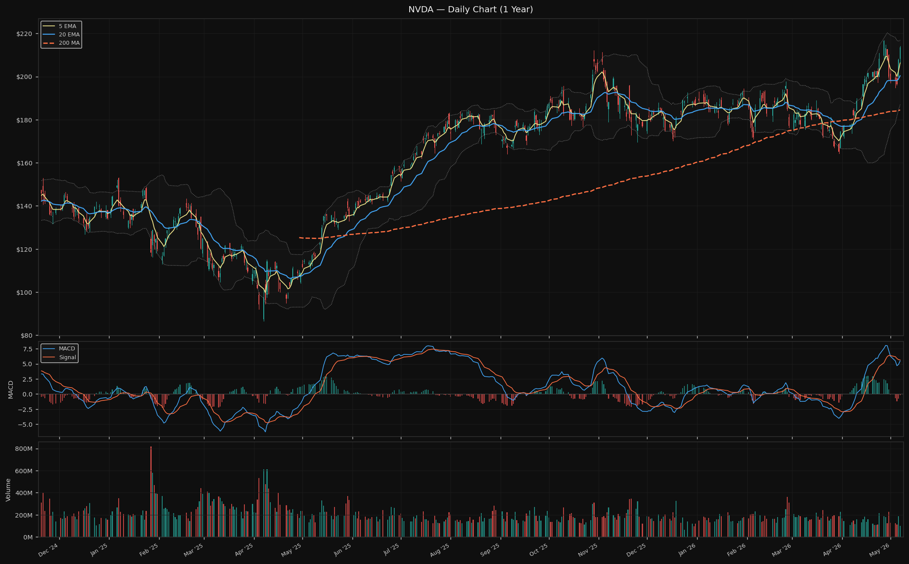

Price $213.55 · 5 EMA $206.28 · 20 EMA $200.36 · 200 MA $184.50
RSI 59.5 (neutral) · MACD: below signal (slight bearish divergence near recent high)
BB position: 88.8% (upper half, but not extreme) · ATR $7.22

NVDA is 1.5% below its 52-week high of $216.83, coiling right at the top of its range with volume rising. The MACD is below signal — a mild caution — but RSI at 59.5 has room to run. The structure is a consolidation near all-time highs, not a breakdown.

#### Key Levels
Resistance: $216.83 (52w high) · $216.91 (BB upper)
Support: $206.28 (5 EMA) · $200.36 (20 EMA) · $187.00 (BB lower)

$216–217 is the zone that has capped the stock twice (52w high and BB upper coincide) — a clean close above opens new high territory. The 20 EMA at $200 is the first meaningful support; a pullback there would be routine within the current uptrend.

#### News (last 48h)
- Nvidia's new home-computing partnership for mini data centres — Yahoo Finance, May 7
- Get Paid 10% To Buy NVDA At A 30% Discount, Here's How (options strategy piece) — Trefis, May 7
- 2 AI Stocks That Could Double Your Money by End of 2026 (NVDA mentioned) — Motley Fool, May 7
- NVIDIA Shares Rally Toward 52-Week High: Buy More or Lock in Gains? — Globe and Mail, May 7

#### Risk Flags
ℹ Beta 2.24 · Short interest 1.0% (minimal)
ℹ Semis correlation cluster: NVDA, MU, SOXL, MRVL all move together in a broad semis selloff

#### Thesis Check
**Status: ✓ Intact**

Data centre revenue growth is tracking the thesis trigger (73% YoY revenue growth far exceeds the >50% threshold). Gross margins at 71.1% are well above the 65% floor that would break the thesis. Hyperscaler capex guidance has continued to increase each quarter per public reports. The stock is -1.5% from all-time highs in a sector that has run 26–31% in a month — the thesis is not just intact, it is being confirmed in real time.

#### Overall Picture
NVDA is the cleanest chart in the AI value chain and is 1.5% from reclaiming all-time highs. The sector has run hard (+26% MoM on SMH), and the coach notes semis are "near-term soft" waiting for 30-day line stabilisation — which in context means short-term digestion, not reversal. The MACD below signal is a minor caution, and the BB at 88.8% position is elevated but not extreme. The fundamental picture remains exceptional. The key tension is whether the 52-week high at $217 acts as resistance in the short-term or is broken on the next catalyst (likely earnings or hyperscaler capex guidance). Nothing in today's data challenges the holding thesis.

---

### MU — Micron Technology, Inc.
**Technology | Semiconductors** | Memory (DRAM, HBM, NAND) for AI

#### Coach Signal
> 「某存储芯片龙头起来了，因为现在机构是在往里面配，基本上现在是每一次跌都有机构进来。但光模块这边就跌得比较多」— ZJJ (22:45)
> 「存储估值框架要换这事儿…需求结构变了 → 长协扩散 → 经营杠杆钝化 → 盈利稳了 → PE能用了 → 比较对象从美光一家，扩到英伟达、台积电、AWS、Meta这一整批AI产业链。」— ZJJ (19:52)

**Signal: Constructive**
Two layers of coach signal today. The structural note argues MU should no longer be valued as a cyclical — the PE/Earnings framework should replace PB/Book frame as HBM creates a Dual market structure with earnings predictability. The tactical note says institutions are buying every dip in the storage leader, and the dips are the entry, not the exit. MU is the most direct US proxy for "storage chip leader" in the portfolio.

#### Macro Relevance
MU benefits doubly from today's macro: semis sector strength (SMH +11.2% above 20 EMA) and weak DXY (-0.5% below EMA) are both tailwinds. Rising rates would be a modest headwind for a high-multiple growth re-rating, but TNX is stable.

#### Fundamentals
P/E 30.5x · Fwd P/E 6.3x · Revenue growth +196% YoY · Gross margin 58.4% · Op margin 67.6%
Analyst target: $556 **(-13.9% below current price of $645)** · 42 analysts · Rec: Strong Buy
FCF $2.89B (modest; bulk of earnings being reinvested in HBM CapEx)

Note: MU is now 16% above consensus analyst target — the market is pricing in a valuation framework upgrade (from cyclical PB to AI-infrastructure PE), which is exactly what ZJJ's note argues is happening and justified.

#### Technical
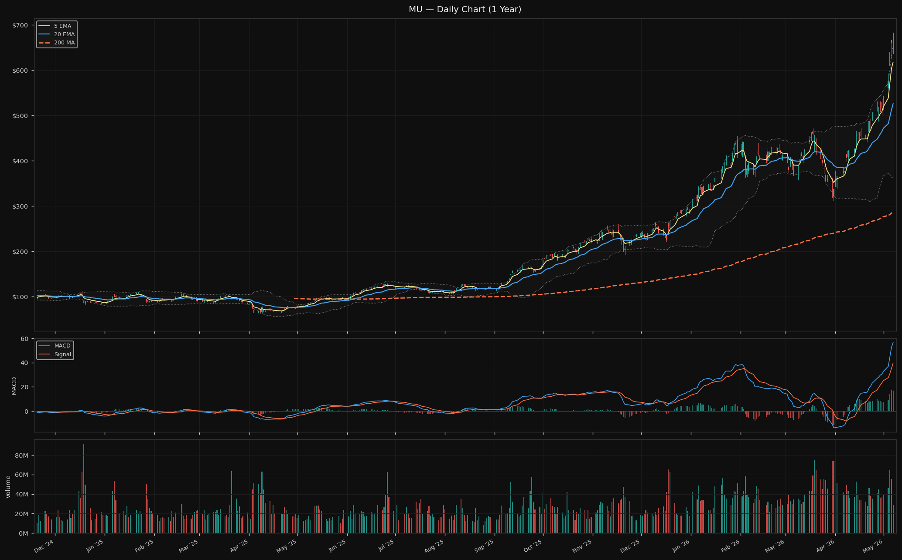

Price $645.67 · 5 EMA $617.80 · 20 EMA $525.91 · 200 MA $287.26
RSI 81.7 (elevated, approaching overbought) · MACD: above signal (bullish)
BB position: 97.0% (at top of Bollinger Band) · ATR $36.66

MU is 4.5% above its 5 EMA, 22.8% above its 20 EMA, and 124.8% above its 200 MA — these are extreme extensions. RSI 81.7 and BB at 97% signal the stock needs digestion. Bernstein and Mizuho (target raised to $740) are constructive on fundamentals, but the technical picture screams "don't chase here."

#### Key Levels
Resistance: $654.31 (BB upper) · $683.09 (52w high)
Support: $617.80 (5 EMA) · $525.91 (20 EMA) · $363.76 (BB lower)

A pullback to the 5 EMA at $617 would be a healthy -4.4% from current — the kind of dip the coach says institutions are buying. The 20 EMA at $525 is the deeper but also valid support. The $683 52-week high is the next target if the fundamental re-rating thesis plays out.

#### News (last 48h)
- Micron hits all-time high; Mizuho raises target to $740 — CoinCentral, May 7
- Will Micron Stock Keep Going Up? Analysts point to $1,000 price target — Watcher Guru, May 7
- Bernstein bullish on memory stocks as DRAM and NAND prices rise — Yahoo Finance, May 7
- Sandisk vs Micron: Which stock has a better chance of continuing its run? — TIKR, May 7
- 2 AI Stocks That Could Double Your Money by End of 2026 (MU mentioned) — Motley Fool, May 7

#### Risk Flags
⚠ RSI 81.7 and BB position 97% — technically extended, meaningful pullback risk
⚠ Price 16% above analyst consensus mean ($556) — requires continued valuation framework upgrade
ℹ Beta 1.92 · Short interest 3.0%
ℹ Semis correlation cluster: drawdown scenario would hit MU alongside NVDA, SOXL, MRVL simultaneously

#### Thesis Check
**Status: ✓ Intact**

Gross margin 58.4% — above the 50% threshold that validates the structural thesis. Revenue growth 196% YoY is extraordinary. The Bernstein and Mizuho analyst upgrades confirm the buy-side is seeing the same valuation framework shift that ZJJ describes. The coach's note that institutions buy every dip is confirmed by today's news flow. The only thesis risk is a cyclical reversal — which requires two consecutive quarters of gross margin guidance drops before it matters. Nothing today triggers that flag.

#### Overall Picture
MU is doing everything the thesis requires but the stock is running extremely hot. RSI 81.7 and BB at 97% make this the most technically extended holding in the portfolio. The coach's structural argument for a valuation re-rating is playing out in real time — analyst targets are being lifted, institutions are accumulating dips, and the HBM demand story is holding. The tension is between a fundamentally improving story and a chart that is priced for perfection near-term. The correct posture per both the thesis and coach guidance is: hold the position, do not add at current levels, and watch the 5 EMA ($617) as the first dip-buy reference if a pullback develops.

---

### SOXL — Direxion Daily Semiconductor Bull 3X Shares
**3x Leveraged Semis ETF** | Tactical momentum instrument

#### Coach Signal
> 「半导体指数/存储/光通信（阶段稍弱等待龙头30日线企稳信号是否出现）」— Joe (盘前)

**Signal: Neutral (near-term caution)**
The semis sector broadly is described as "near-term soft" — waiting for the sector leaders' 30-day line to establish a stabilisation signal before the next move. For a 3x leveraged instrument, this translates to: not the time to add, monitor for confirmation.

#### Macro Relevance
SMH is 11.2% above 20 EMA (+26.4% MoM) — the underlying index SOXL tracks (SOX via 3x leverage) is in a strong uptrend. However, the 3x leverage means SOXL is up ~202% from its 200 MA ($51) — any sector consolidation is amplified 3x.

#### Fundamentals
ETF — no fundamental data applicable.

#### Technical
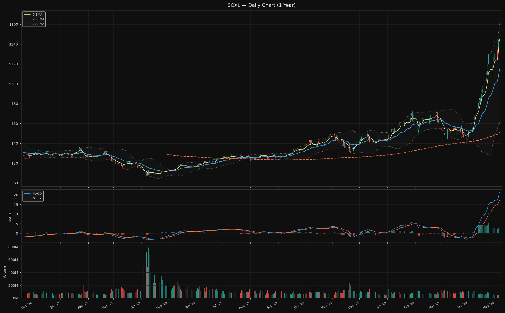

Price $154.40 · 5 EMA $146.52 · 20 EMA $116.23 · 200 MA $51.01
RSI 73.7 (elevated) · MACD: above signal (bullish but extended)
BB position: 91.6% · ATR $12.35

SOXL is 5.4% above its 5 EMA, 32.8% above its 20 EMA — extreme extension driven by the 3x leverage applied to SMH's 26% MoM move. The thesis exit signal (SMH breaks below 20-day EMA on a daily close) is not triggered — SMH is $54.71 above its 20 EMA. Position is intact per thesis criteria.

#### Key Levels
Resistance: $162.80 (BB upper) · $166.00 (52w high)
Support: $146.52 (5 EMA) · $116.23 (20 EMA)

The 5 EMA at $147 is the first meaningful support level. A dip to the 20 EMA ($116) would represent a -25% pullback from current — within range given 3x leverage on a volatile index. The thesis exit signal activates only if SMH's 20-day EMA is broken on a close.

#### News (last 48h)
- SMH vs SOXX vs SOXL: Which Semiconductor ETF to Buy in May 2026 — Gotrade, May 7
- Up 160% in One Month, This AI ETF Can Still 5X — 24/7 Wall St., May 5

#### Risk Flags
⚠ RSI 73.7 and BB position 91.6% — extended; sector digestion would amplify 3x
ℹ SOXL is a 3x leveraged ETF. Daily rebalancing creates volatility decay in sideways/choppy markets. This is a tactical position, not a long-term hold. Exit signal: SMH daily close below its 20 EMA.
ℹ Semis correlation cluster holding applies directly — SOXL amplifies any sector-wide move

#### Thesis Check
**Status: ✓ Intact**

SMH and SOXX are both above their 20 EMAs (+11.2% and +12.0%) — the thesis conditions for holding are met. Semis sector earnings cycle is in expansion phase (NVDA, MU both showing strong numbers). No signs of rotation out of semis yet, though capital is temporarily in software. The coach's note ("near-term soft, wait for 30-day line stabilisation") is consistent with holding but not adding. The 2022-style risk (90% drawdown) requires a fundamental sector break, which current data does not show.

**What to watch:** SMH daily close below its 20 EMA ($489) is the trip-wire. Currently trading $54 above that level.

#### Overall Picture
SOXL is the portfolio's amplifier — when semis are strong, it works; when they stumble, it hurts hard. The underlying thesis conditions (SMH above 20 EMA, semis in earnings expansion) remain intact. The technical extension is extreme, which is appropriate for a 3x instrument in the middle of a 26% sector rally. Hold per thesis criteria. The coach's "near-term soft, wait for 30-day line stabilisation" is a signal to not add, not to exit. Volatility decay risk is elevated in a sideways environment — if the sector enters a multi-week chop rather than continuing to trend, trimming to reduce decay exposure is worth considering.

---

### MRVL — Marvell Technology, Inc.
**Technology | Semiconductors** | High-speed networking chips, storage controllers, custom silicon

#### Coach Signal
> 「最终资金还是会回到AI硬件、AI infra基建这一块。」— ZJJ (22:45)
> 「半导体指数阶段稍弱」— Joe (盘前)

**Signal: Constructive (medium-term) / Neutral (near-term)**
MRVL is not called out specifically by name, but as a core AI networking semiconductor it falls under ZJJ's "capital returns to AI hardware infra" umbrella. The "semis near-term soft" note applies — the sector is digesting after a big move, and MRVL just had a bearish MACD cross.

#### Macro Relevance
Semis sector strength is directly relevant. Weak DXY is marginally positive for MRVL's international revenue. Stable rates support valuation of a mid-growth semiconductor.

#### Fundamentals
P/E 53.1x · Fwd P/E 29.9x · Revenue growth +22.1% YoY · Gross margin 51.0% · Op margin 18.7%
Analyst target: $130.28 **(-19.8% below current price of $162)** · 39 analysts · Rec: Strong Buy
FCF $1.44B; debt-to-equity 33.5x (elevated but manageable for semis)

MRVL is 24.7% above analyst consensus — a significant stretch. This can be justified only if the market is pricing in the custom silicon pipeline materialising faster than current estimates. Op margin at 18.7% is still below the 25%+ target in the thesis.

#### Technical
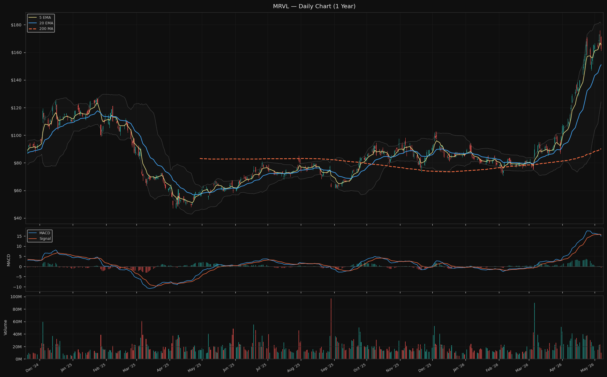

Price $162.43 · 5 EMA $165.39 · 20 EMA $150.99 · 200 MA $90.22
RSI 66.3 (elevated but below overbought) · MACD: **bearish cross** (MACD just crossed below signal)
BB position: 67.3% (mid-range) · ATR $9.29

MRVL is the only AI value chain holding showing a bearish MACD crossover — a mild but noteworthy signal. Price is -1.8% below its 5 EMA, meaning the recent high may be in. The stock hit an all-time high recently (news confirms "Marvell Reaches All Time Highs") and is now pulling back — normal consolidation after a 202.8% move from its 52-week low.

#### Key Levels
Resistance: $170.84 (recent swing high) · $175.80 (52w high) · $180.99 (BB upper)
Support: $150.99 (20 EMA) · $146.85 (swing low) · $124.28 (BB lower)

The 20 EMA at $151 is the key support to watch — a pullback there would represent a healthy -7.1% from current and keep the uptrend intact. The 52-week high at $175.80 is the next resistance if the bearish cross resolves back to bullish.

#### News (last 48h)
- Marvell Reaches All Time Highs: Buy, Sell or Hold? — 24/7 Wall St., May 7
- Marvell Stock Targets $15 Billion in Revenue by 2028 — TIKR, May 7
- Stars Align for Nasdaq Composite as Chip Stocks Roar — 24/7 Wall St., May 7
- Investors Heavily Search MRVL: Here is What You Need to Know — Yahoo Finance, May 7

#### Risk Flags
⚠ MACD bearish cross — suggests short-term momentum peak
⚠ Price 24.7% above analyst consensus — requires significant earnings execution to justify
ℹ Beta 2.25 · Short interest 4.0%
ℹ Semis correlation cluster: any sector-wide sell hits MRVL alongside NVDA, MU, SOXL

#### Thesis Check
**Status: ✓ Intact**

Revenue growth at 22.1% YoY is above the 15% floor in the thesis. Op margin at 18.7% is still tracking toward 25%+ — improving but not yet there. The thesis explicitly notes that at RSI 96 and 23% above analyst consensus (as of initial draft), the stock prices in near-perfect execution; today RSI has normalised to 66 and price is -19.8% vs consensus — this is actually a healthier setup than the original entry point. No break in the networking/storage controller thesis has occurred.

#### Overall Picture
MRVL just touched an all-time high and is now digesting with a bearish MACD cross — this is normal behaviour after a 200%+ rally from the 52-week low. The coach's structural call (capital returns to AI hardware infra) is positive for MRVL's medium-term. The near-term picture is caution: MACD bearish cross, price below 5 EMA, sector in "near-term soft" mode per Joe's note. The 20 EMA at $151 is the level that separates healthy consolidation from trend deterioration. Nothing in today's data challenges the fundamental thesis, but the technical picture calls for patience rather than adding.

---

### APH — Amphenol Corporation
**Technology | Electronic Components** | Connectors and interconnects for AI infrastructure

#### Coach Signal
*Coach guidance today does not specifically address APH or the connector sector.*

#### Macro Relevance
As the most defensive AI infrastructure play with the lowest beta (1.30) in the AI value chain holdings, APH is less affected by the risk-on/risk-off backdrop. Stable rates support its steady compounding model. The sector rotation context (capital currently in software, eventually returns to AI hardware) is mildly positive.

#### Fundamentals
P/E 39.0x · Fwd P/E 24.1x · Revenue growth +58.4% YoY · Gross margin 37.9% · Op margin 27.3%
Analyst target: $181.72 (+33.9% upside) · 18 analysts · Rec: Buy
FCF $3.56B · Current ratio 1.71 (healthy)

Revenue growth 58.4% YoY is exceptional and well above the >10% organic threshold in the thesis. Operating margin at 27.3% is holding above the 25% target. The 33.9% analyst upside is the second highest in the portfolio (after VST). Q2 dividend of $0.25/share was declared — dividend continuity intact.

#### Technical
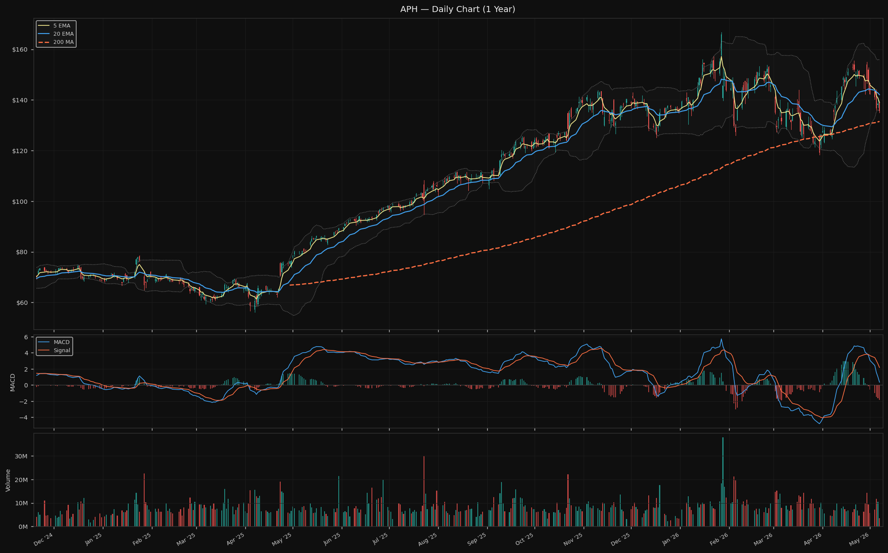

Price $135.69 · 5 EMA $138.99 · 20 EMA $142.06 · 200 MA $131.50
RSI **28.6 (oversold)** · MACD: below signal
BB position: **0.3% (at lower Bollinger Band)** · ATR $5.62

APH is the most technically oversold holding in the portfolio by a wide margin. RSI 28.6 is in oversold territory (<30), the stock is sitting at the absolute lower edge of its Bollinger Band (0.3% position), and it is -18.6% from its 52-week high of $166.71. The stock is in a clear short-term downtrend but by classic reversal indicators, it is at a level where bounce probability increases.

#### Key Levels
Resistance: $143.97 (recent swing high) · $154.92 · $155.46
Support: $135.63 (BB lower) · $131.50 (200 MA) · $127.35 (swing low)

$135.63 (BB lower) is the immediate support — the stock is right on it. The 200 MA at $131.50 is the next level below. A break below $131 would be a significant technical deterioration. On the upside, the first resistance is the recent swing high at $143.97 — reclaiming that would require a +6.1% recovery.

#### News (last 48h)
- Amphenol announces Q2 2026 dividend ($0.25/share, July 15 payout) — May 7
- Praxis Investment Management bought APH shares — MarketBeat, May 7
- Patton Albertson Miller Group trimmed APH stake — MarketBeat, May 7

#### Risk Flags
⚠ -18.6% from 52-week high while sector peers rally — notable underperformance
⚠ RSI 28.6 and BB at 0.3% — oversold but downtrend not yet reversed
ℹ Beta 1.30 · Short interest 1.0% (low — not driven by short selling)
ℹ €1.1B debt issuance (May 2026) noted in thesis — adding leverage at a time of technical weakness

#### Thesis Check
**Status: ⚠ Monitor**

The fundamental thesis remains intact (revenue +58.4%, op margin 27.3% above threshold) but the technical underperformance is an active concern that was flagged in the thesis at initial draft. APH has now fallen further (-18.6% from 52w high) while peers like NVDA and MRVL rallied to all-time highs. This divergence has widened.

**What changed:** Continued technical underperformance relative to sector peers, now RSI oversold (28.6). The €1.1B debt issuance may be weighing on sentiment.

**What to watch next:** Whether the 200 MA at $131.50 holds on any further downside. Also Q2 earnings (timing unknown) — a revenue miss given the premium multiple would be a more serious thesis threat.

#### Overall Picture
APH presents the most conflicted picture in the portfolio: the fundamentals are healthy and the 33.9% analyst upside is compelling, but the stock is the weakest chart in the AI value chain. RSI 28.6 and BB at 0.3% indicate a meaningful oversold condition — historically this is where reversals occur in a quality compounder. However, the relative underperformance against peers suggests the market sees something specific (the debt issuance, or AI hardware spending peaking at key customers). The 200 MA at $131 is the last meaningful support before more significant technical damage. Coach guidance is silent on APH; the decision rests entirely on fundamental patience vs technical momentum.

---

### VST — Vistra Corp.
**Utilities | Independent Power Producers** | AI data centre power (gas + nuclear)

#### Coach Signal
> 「电力、液冷」— Joe (盘前), listed as one of the right-side (strong) sector plays alongside semis

**Signal: Constructive**
Joe explicitly lists power and liquid cooling in the "right side" (强势) sectors. VST as the portfolio's power play is a direct beneficiary of this signal. Combined with today's Q1 earnings beat and credit upgrade, this is the most catalyst-rich stock in this session.

#### Macro Relevance
VST is a utilities company in practical terms, so it benefits from falling oil prices (Iran deal, macro normalisation) reducing energy competition and from a stable interest rate environment (VST carries significant debt). The risk-on macro is positive for the AI power demand narrative.

#### Fundamentals
P/E 73.2x · Fwd P/E 14.1x · Revenue growth +13.6% YoY · Gross margin 33.2% · Op margin 13.2%
Analyst target: $229.28 (+43.7% upside) · 18 analysts · Rec: Strong Buy
Note: Trailing EPS $2.18 (depressed by Q1 2025 comps), Forward EPS $11.34 (significant step-up) — Fwd P/E 14x is the correct lens

**Q1 2026 earnings results (just reported):** $1B profit reported. Second credit rating agency upgraded VST to investment grade. 2026 guidance reaffirmed as strong.

#### Technical
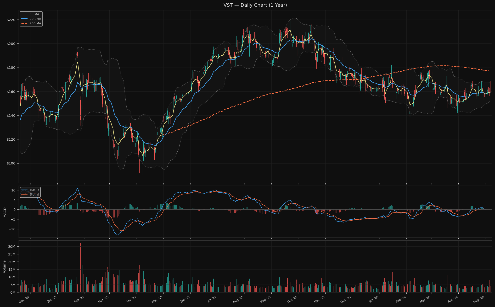

Price $159.59 · 5 EMA $159.14 · 20 EMA $158.84 · 200 MA $176.93
RSI 46.1 (neutral) · MACD: below signal
BB position: 49.3% (mid-band) · ATR $6.84

VST is sitting right at both its 5 EMA and 20 EMA simultaneously — a coiling pattern at neutral RSI. This was the "pre-catalyst setup" described in the thesis at initial draft. The Q1 earnings beat is the catalyst that may resolve this coil upward. The 200 MA at $177 is overhead resistance and the main target.

#### Key Levels
Resistance: $167.42 (BB upper) · $168.42 · $168.49 (swing highs)
Support: $159.14 (5 EMA) · $158.84 (20 EMA) · $154.13 (swing low)

The $167–168 zone is the first real resistance (BB upper + swing highs cluster). The EMAs at $159 are now the floor — a close below both would be bearish for the setup. The 200 MA at $176.93 is the medium-term target.

#### News (last 48h)
- Vistra posts $1B profit; second agency lifts credit to investment grade — Stock Titan, May 7
- Vistra Corp. swings to Q1 profit and reaffirms strong 2026 guidance — Stock Titan, May 7
- Nuclear Stock Vistra Pops On Earnings But Uranium Producer Soars — Yahoo Finance, May 7
- Why Vistra Corp Stock Is Powering Higher Today — TipRanks, May 7

#### Risk Flags
⚠ -27.2% from 52-week high of $219.21 — still well below peak despite earnings beat
⚠ FCF was -$0.46B (negative) — monitoring whether earnings-to-cash conversion improves
ℹ Beta 1.45 · Short interest 4.0%
ℹ D/E 399.6x (utility-typical but elevated) · Current ratio 0.78 (tight near-term liquidity)

#### Thesis Check
**Status: ✓ Intact — Catalyst Confirmed**

The thesis identified Q1 earnings as the catalyst that would "likely resolve direction." Today's result is unambiguously positive: $1B profit, investment grade credit upgrade, guidance reaffirmed. The "AI power narrative is speculative until actual PPAs are signed" bear case caveat remains open — but the credit upgrade suggests the market is beginning to validate VST's financial position for long-term contract counterparty purposes. FCF still negative but the earnings trajectory is improving sharply (trailing EPS $2.18 → forward EPS $11.34).

#### Overall Picture
VST delivered exactly the catalyst the thesis was waiting for. Q1 profit, credit upgrade to investment grade, and strong guidance — all three matter. The stock is still 27% below its 52-week high, meaning the initial earnings pop has significant catch-up potential if the market begins pricing in the Fwd P/E 14x as the correct multiple. The coil at neutral RSI and mid-Bollinger Band has now been resolved by positive catalysts. Coach's "power/liquid cooling = right side" signal adds confirmation. The $167–168 resistance zone (BB upper + swing highs) is the first test. If that breaks, the 200 MA at $177 becomes the target.

---

### MO — Altria Group, Inc.
**Consumer Defensive | Tobacco** | High-yield dividend anchor

#### Coach Signal
*Coach guidance today does not specifically address MO or the tobacco sector.*

#### Macro Relevance
MO is low-beta (0.52) defensive — the risk-on macro environment is neutral-to-slightly-negative (risk appetite flows away from defensive yield stocks). However, the coach's "wait for US-China summit" posture implies the risk-on environment is not yet fully trusted, which supports holding defensive positions.

#### Fundamentals
P/E 14.5x · Fwd P/E 11.8x · Revenue growth +5.3% YoY · Gross margin 87.4% · Op margin 62.3%
Analyst target: $69.00 (-0.4% vs current) · 11 analysts · Rec: Hold
Dividend yield ~6% (annual $4.08/share) · FCF $8.54B

MO is exactly at analyst consensus — no upside priced in. The story is all about the yield and dividend sustainability, not capital appreciation.

#### Technical
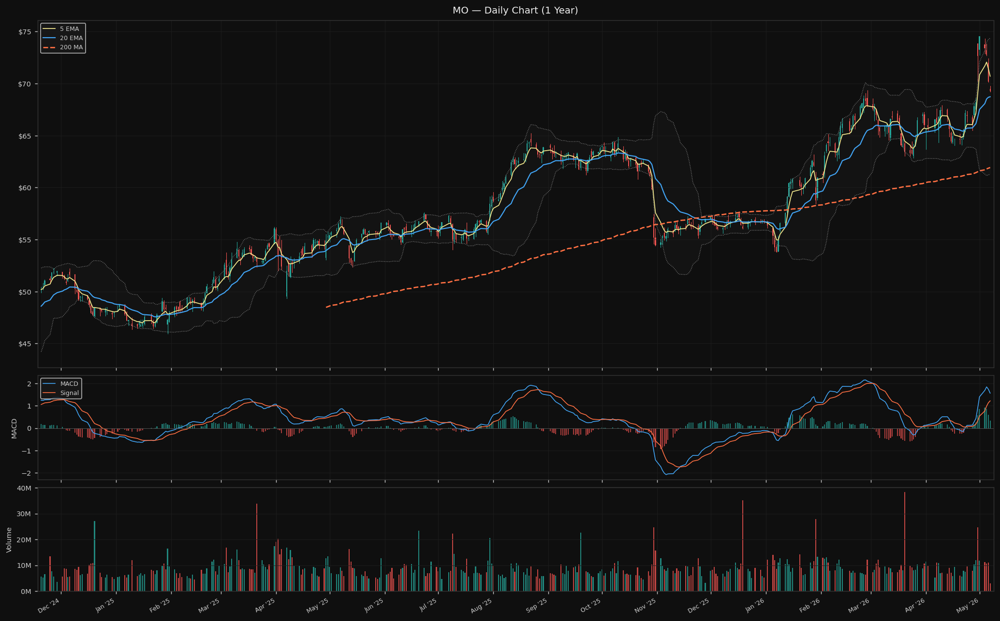

Price $69.26 · 5 EMA $70.71 · 20 EMA $68.73 · 200 MA $61.93
RSI 64.2 (moderate) · MACD: above signal (bullish)
BB position: 60.9% (mid-upper) · ATR $1.78

MO had its best week in six years per news reports. The stock is 0.8% above its 20 EMA, MACD is bullish, and RSI at 64.2 is healthy without being extreme. This is a constructive technical setup for a defensive.

#### Key Levels
Resistance: $69.35 (very close swing high) · $74.38 (BB upper) · $74.56 (52w high)
Support: $68.73 (20 EMA) · $64.08 · $62.87

The 52-week high at $74.56 is 7.6% above current price — a clear target. The 20 EMA at $68.73 is the first support, very close to current price.

#### News (last 48h)
- MO stock eyes best week in six years: pricing power offsets falling cigarette volumes in Q1 — MSN, May 7
- Dividends vs. the 4% Rule: portfolio yield analysis piece — 24/7 Wall St., May 7
- Multiple institutional position updates (Principal, Mitsubishi UFJ, Premier Fund Managers)

#### Risk Flags
ℹ Beta 0.52 · Short interest 3.0%
ℹ At analyst consensus — limited sell-side upside narrative

#### Thesis Check
**Status: ✓ Intact**

The thesis proof metrics focus on dividend maintenance and oral nicotine growth. The Q1 report showed pricing power offsetting volume declines — combustible volumes declining within the expected range. The dividend is intact (Q2 not yet declared but no signals of a cut). Oral nicotine growth trajectory is positive per the earnings read. The thesis requires holding through managed decline, and the business is executing that playbook.

#### Overall Picture
MO is the quiet performer in the portfolio — best week in six years, technically constructive, fundamentals on track. Its role is ballast and yield, and it is fulfilling that role. No action warranted. The stock is near the top of its near-term range at $69 vs $74.56 52-week high — the next 7.6% is there if the bull market continues. The main risk remains FDA action on oral nicotine, which has no catalyst today.

---

### WMT — Walmart Inc.
**Consumer Defensive | Discount Stores** | Retail/advertising/fulfilment platform

#### Coach Signal
*Coach guidance today does not specifically address WMT or the retail sector.*

#### Macro Relevance
Weak DXY (-0.5% below 20 EMA) is a mild positive for WMT's international operations (Flipkart India, Walmex Mexico). The consumer-defensive profile means WMT benefits modestly from risk-on environments (consumers spend more) but is not a primary beneficiary. TD Cowen raised their WMT price target citing "growth momentum."

#### Fundamentals
P/E 47.4x · Fwd P/E 39.5x · Revenue growth +5.6% YoY · Gross margin 24.9% · Op margin 4.6%
Analyst target: $136.68 (+5.5% upside) · 41 analysts · Rec: Strong Buy
FCF $10.55B (strong cash generation)

WMT trades at a premium (40x fwd P/E) justified by the advertising/marketplace mix shift thesis. Revenue growth at 5.6% YoY is modest but the premium is for earnings quality and business model evolution, not top-line speed.

#### Technical
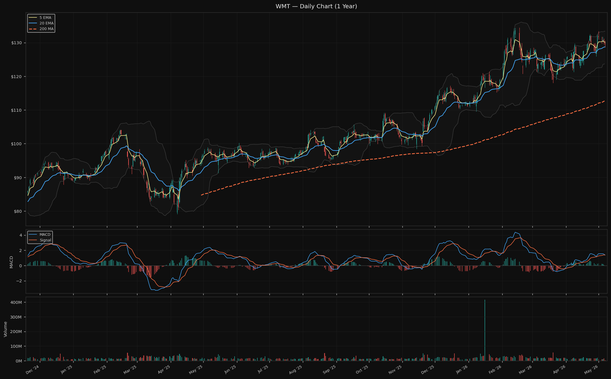

Price $129.52 · 5 EMA $130.05 · 20 EMA $128.73 · 200 MA $112.76
RSI 56.1 (neutral) · MACD: **bearish cross** (mild)
BB position: 60.3% (mid-range) · ATR $2.35

WMT is neutral technically — between its 5 EMA and 20 EMA, RSI 56, mid-Bollinger Band, with a recent bearish MACD cross that is mild and common in a sideways consolidation. The 3.6% below its 52-week high suggests a healthy base rather than a breakdown.

#### Key Levels
Resistance: $129.69 (swing high — very close, price is right there) · $132.46 · $133.38 (BB upper)
Support: $128.73 (20 EMA) · $125.91 · $123.65 (BB lower)

WMT is sitting right under a swing high at $129.69 — a clean break above that opens $132–133. The 20 EMA at $128.73 is only $0.79 below — the floor is tight and the setup is a potential breakout or stall.

#### News (last 48h)
- TD Cowen raises WMT price target on growth momentum — Investing.com, May 7
- Walmart blurs line between growth and defensive stock as Amazon rivalry intensifies — foreignpolicyjournal.com, May 7
- Why more retailers are offering same-day delivery (WMT context) — Supply Chain Dive, May 7

#### Risk Flags
ℹ Beta 0.65 · Short interest 2.0%
ℹ Bearish MACD cross (mild — not a trend signal, just near-term momentum flag)

#### Thesis Check
**Status: ✓ Intact**

TD Cowen raising the target on growth momentum is a direct signal that the advertising/marketplace thesis is being recognised. US comparable sales growth trajectory needs to be monitored (thesis threshold: below 3% for two consecutive quarters = break), but no data today threatens this. WMT is executing the platform transition and the premium multiple is being supported by analyst upgrades.

#### Overall Picture
WMT is a steady-state holding — no drama, thesis intact, analyst upgrades continuing, technical setup neutral-to-slightly-constructive. The stock is coiling just below a swing high at $129.69. If the broad market continues higher into the US-China summit, WMT likely participates. No action needed.

---

### PDD — PDD Holdings Inc.
**Consumer Cyclical | Internet Retail** | China e-commerce (Pinduoduo, Temu)

#### Coach Signal
> 「中概龙1/3（重点观察低位突破的），豆包订阅商业化推进的催化」— Joe (盘前)

**Signal: Neutral-Cautious**
Joe mentions "China ADR top names 1/3 — watch for low-level breakouts" as a left-side value play. PDD fits this category. "豆包商业化" (ByteDance Doubao monetisation) is mentioned as a catalyst for China tech broadly — this is indirect context for PDD. The signal is "it's interesting at low levels but not confirmed right side yet."

#### Macro Relevance
US-China summit optimism is the single most important macro factor for PDD today. ZJJ notes China is helping mediate US-Iran and trade tensions — a positive backdrop for Chinese ADRs. Weak DXY is a tailwind for Temu's international revenue when converted to RMB terms. PDD is below its 200 MA (-11.1%) — this is the one holding where macro (US-China relations) matters more than fundamentals.

#### Fundamentals
P/E 10.6x · Fwd P/E 7.2x · Revenue growth +12.0% YoY · Gross margin 56.3% · Op margin 21.1%
Analyst target: $142.89 (+40.1% upside) · 33 analysts · Rec: Buy
FCF $85.63B (extraordinary — highest absolute FCF in the portfolio)

PDD is the most fundamentally undervalued holding: Fwd P/E 7.2x with 40% analyst upside. The geopolitical discount is the entire debate.

#### Technical
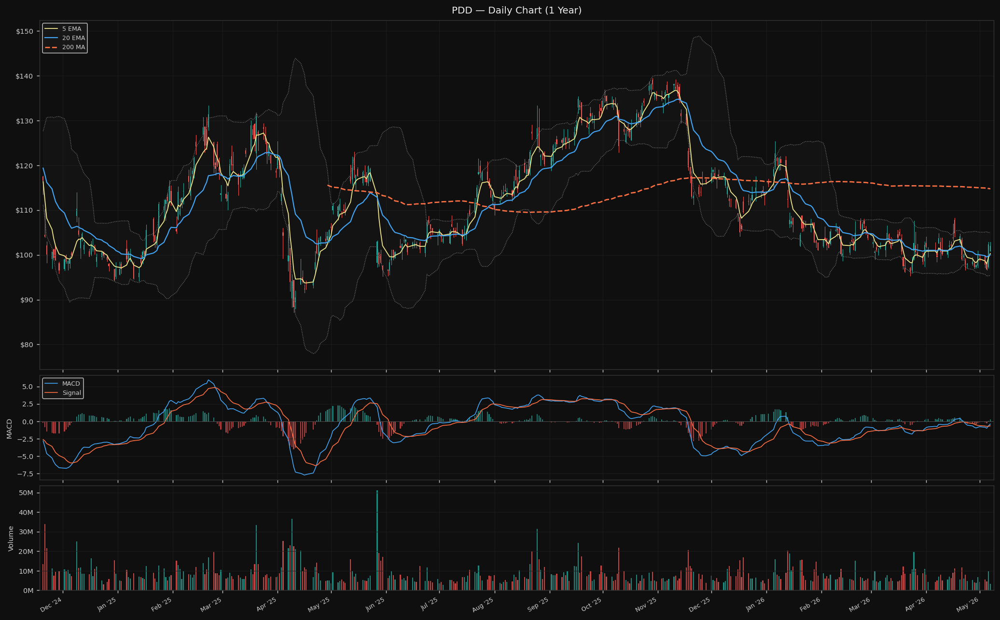

Price $102.00 · 5 EMA $100.30 · 20 EMA $99.99 · 200 MA $114.75
RSI 43.8 (below-neutral) · MACD: above signal (mild bullish)
BB position: 68.3% · ATR $2.55

PDD has recovered from the May 7 low ($95 area of concern in thesis). It is now 1.7% above its 5 EMA, 2.0% above 20 EMA, and MACD is mildly bullish. The 52-week low support ($95.24) held — a critical result given the thesis flagged $95 as the line. Downside: still 11.1% below 200 MA — needs sustained momentum to recover the longer-term structure.

#### Key Levels
Resistance: $104.80 · $105.08 (BB upper proximity) · $107.65 (swing high)
Support: $100.30 (5 EMA) · $99.99 (20 EMA) · $99.04 (swing low)

The $99–100 zone (5 EMA + 20 EMA cluster) is the critical support shelf. The thesis noted $95 as the line; holding $100 now creates a better technical floor. Resistance at $104–108 is the next zone.

#### News (last 48h)
- PDD Holdings Attracting Investor Attention — Yahoo Finance, May 6
- No China-specific regulatory news in the past 48 hours

#### Risk Flags
⚠ -26.8% from 52-week high — deepest drawdown in the portfolio
⚠ Below 200 MA (-11.1%) — only holding with this characteristic
ℹ China-listed ADR — exposed to US-China regulatory risk, delisting risk, yuan factors
ℹ Beta 0.03 (extremely low — ADR pricing disconnected from US market moves)

#### Thesis Check
**Status: ⚠ Monitor → moving toward Intact**

The critical $95 52-week low level held. PDD is now $102, back above both short-term EMAs, with MACD turning mildly bullish. The US-China summit optimism (both ZJJ and Joe reference it as the near-term risk-off floor) is a material positive catalyst for Chinese ADRs broadly. Revenue growth at 12% YoY is decelerating from prior rates — worth monitoring but not a thesis break yet. The coach's "中概龙 watch for low-level breakouts" is the right framework: this is a potential breakout watch, not a chase.

**What changed (improving):** $95 support held. Price recovered above both short-term EMAs. US-China summit optimism provides a macro catalyst. Coach identifies it as a left-side value name worth watching.

**What to watch next:** Whether PDD can clear $107 (swing high) on volume, and whether the US-China summit produces any tariff/trade language supportive of Chinese ADRs.

#### Overall Picture
PDD is the portfolio's wildcard. The fundamentals are exceptional (Fwd P/E 7.2x, FCF $85B, 40% upside) but the market will not price those fundamentals until the geopolitical discount shrinks. The US-China summit is the near-term catalyst that could begin closing that discount. The stock held its critical support ($95) and is now attempting a recovery. Joe's "中概龙 low-level breakout watch" frames it correctly: this is a recovery watch, not a momentum buy. Keep holding per thesis. If the summit produces positive trade language, this could be the beginning of a re-rating.

---

### DAL — Delta Air Lines, Inc.
**Industrials | Airlines** | Premium travel and loyalty programme

#### Coach Signal
> 「伊朗MOU进入72小时关键窗口」— Joe (盘前)

**Signal: Constructive (indirect)**
The Iran MOU geopolitical de-escalation is directly relevant for airlines — lower oil prices (ZJJ: "油价一直在跌" = oil keeps falling post-Iran deal) reduce DAL's primary cost input. This is an indirect but meaningful positive signal for the airlines thesis.

#### Macro Relevance
Oil price decline (US-Iran deal) is the most important macro factor for DAL today. Lower oil = lower fuel costs = higher operating margins. The risk-on environment (US-China optimism + Iran deal) is broadly positive for travel demand. UBS raised DAL's target to $95 citing the premium cabin strategy.

#### Fundamentals
P/E 10.8x · Fwd P/E 9.2x · Revenue growth +12.9% YoY · Gross margin 19.9% · Op margin 3.2%
Analyst target: $79.45 (+7.8% upside) · 25 analysts · Rec: Strong Buy
FCF $3.09B · DAL targeting $13 EPS per UBS (premium cabin strategy)

The Fwd P/E 9.2x remains cheap for a consistently profitable airline with a loyalty programme moat. Operating margin at 3.2% is below the 10% thesis threshold — this needs to recover as the Q2/Q3 travel season unfolds.

#### Technical
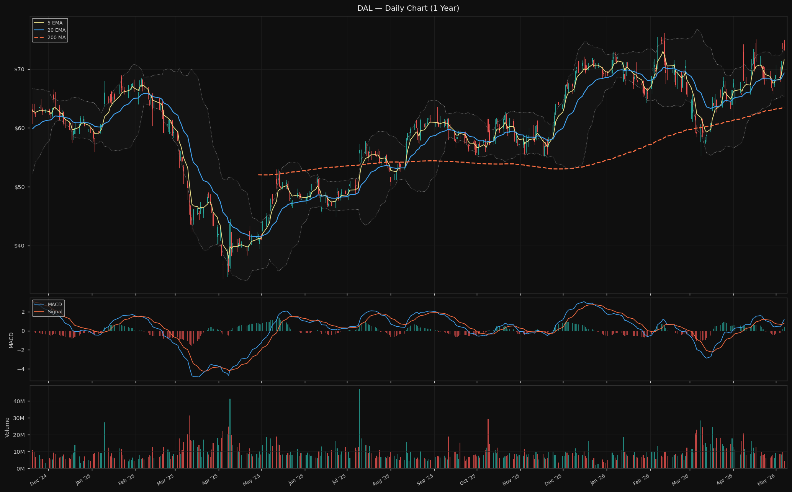

Price $73.67 · 5 EMA $71.58 · 20 EMA $69.35 · 200 MA $63.54
RSI 57.0 (neutral) · MACD: above signal (bullish)
BB position: **97.7% (at upper Bollinger Band)** · ATR $2.25

DAL is 97.7% up the Bollinger Band — near the upper edge. The stock has run 6.2% above its 20 EMA and 2.9% above its 5 EMA on the Iran deal catalyst. Near-term, it is extended and susceptible to consolidation. But the MACD is bullish and the uptrend from the 52-week low ($44.24) is solid.

#### Key Levels
Resistance: $73.86 (BB upper) · $74.19 · $75.02 (swing high) → $76.18 (52w high)
Support: $71.58 (5 EMA) · $69.35 (20 EMA) · $65.82 (swing low)

DAL is right at the BB upper ($73.86). A close above $75.02 would break through to the 52-week high zone. If the Iran deal holds and oil stays down, the $76 52-week high is achievable. A pullback to the 5 EMA at $71.58 would be a healthy -3.0%.

#### News (last 48h)
- UBS raises DAL target to $95, citing premium cabin strategy targeting $13 EPS — 24/7 Wall St., May 7
- Prediction: These 2 Airline Stocks Will Rebound Before Year's End — Motley Fool, May 7 (DAL mentioned)
- M&T Bank Corp raises DAL stake — MarketBeat, May 7

#### Risk Flags
⚠ BB position 97.7% — short-term extended, consolidation likely
ℹ Beta 1.25 · Short interest 4.0%
ℹ Iran deal is 72h window — deal collapse would reverse part of the oil/geopolitics tailwind
ℹ Op margin 3.2% still below 10% thesis threshold (Q2–Q3 seasonality should improve)

#### Thesis Check
**Status: ✓ Intact**

Revenue growth 12.9% YoY is healthy. UBS raised the target to $95 specifically citing the premium cabin strategy and $13 EPS path — these are the exact metrics the thesis tracks (RASM and premium travel demand). FCF $3.09B is positive. The Iran deal provides an immediate fuel cost tailwind. No thesis break conditions are close to being triggered.

#### Overall Picture
DAL is executing on its premium travel strategy and is benefiting from the Iran deal geopolitical tailwind. The stock is near its BB upper (97.7%) so some consolidation is expected near-term. The UBS target of $95 vs current $73.67 represents 28.9% upside — well above the 7.8% consensus mean, reflecting growing confidence in the premium cabin monetisation thesis. Coach signal on Iran MOU is incrementally positive. The main risk is deal collapse (72h window) or oil spiking back. Hold and watch the $75 breakout level.

---

## Watchlist

---

### SNDK — Sandisk Corporation
**Technology | Computer Hardware** | Pure-play NAND flash storage

#### Coach Signal
> 「需求结构变了 → 长协扩散 → 经营杠杆钝化 → 盈利稳了 → PE能用了」ZJJ (19:52)
> 「某存储芯片龙头起来了，因为现在机构是在往里面配」ZJJ (22:45)

**Signal: Constructive on the sector / Watchlist maintained**
The storage valuation framework piece directly supports SNDK's re-rating thesis. ZJJ explicitly talks about storage institutions buying dips. However, SNDK dropped today ("Why Sandisk Stock Just Dropped," "SanDisk Leads Losses In Data Storage") — this is the dip the coach says institutions buy.

#### Macro Relevance
Same drivers as MU: semis sector strength and AI memory demand are the tailwinds. SNDK is more volatile than MU (it is a newer spinoff with 10% short interest vs MU's 3%).

#### Fundamentals
P/E 45.2x · Fwd P/E 7.9x · Revenue growth +251% YoY (spinoff base effect) · Gross margin 56.0% · Op margin 70.0%
Analyst target: $1,366 (+3.0% upside) · 22 analysts · Rec: Buy

Revenue growth is artificially high due to the spinoff comparison base. The sustainable metric is gross margin at 56% (above the 50% thesis entry threshold) and operating margin at 70% (exceptional). AustralianSuper opened a new $99.6M position today — institutional validation.

#### Technical
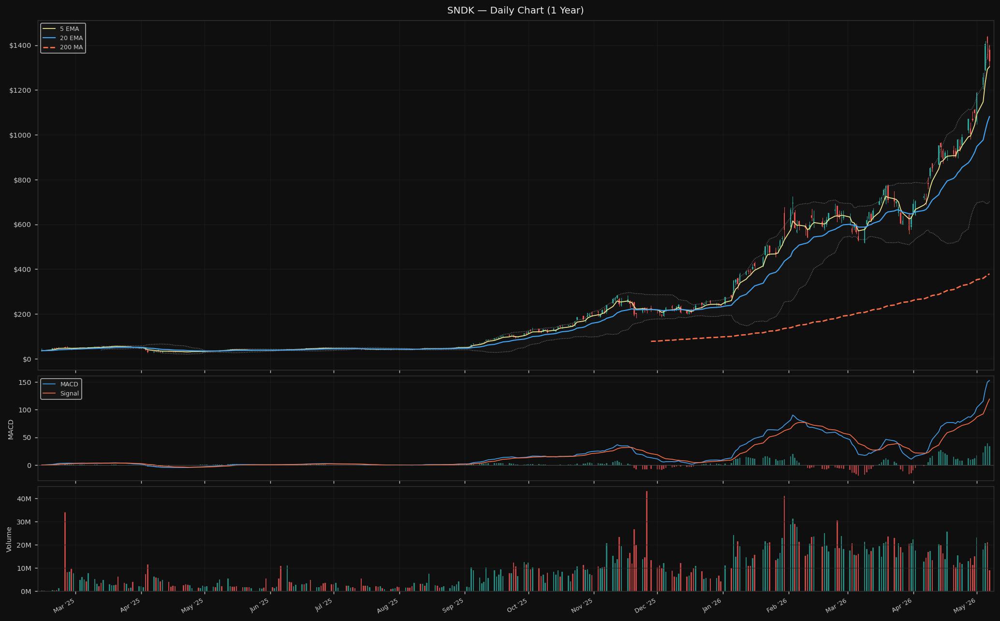

Price $1,328.40 · 5 EMA $1,304.14 · 20 EMA $1,081.08 · 200 MA $379.17
RSI 74.4 (elevated) · MACD: above signal
BB position: 89.6% · ATR $86.93

SNDK RSI has come down from 82.9 (initial thesis draft) to 74.4 — slightly less extreme but still elevated. The stock is 22.9% above its 20 EMA. Entry conditions in the thesis require RSI below 60 and preferred zone is a pullback to 5 EMA (~$1,304) or 20 EMA (~$1,081). Today's dip is moving toward the 5 EMA target.

#### Thesis Check
**Status: Watchlist — entry conditions not yet met**

Gross margins at 56% (above 50% threshold) and the institutional buying noted by coach are positive signals. However, RSI 74.4 is still above the entry trigger of <60. The thesis entry zone remains pullback to 5 EMA ($1,304) at minimum, with better entry at 20 EMA ($1,081).

**Entry consideration:** The drop today brings price toward the 5 EMA at $1,304. A close near $1,304 on diminishing volume with RSI resetting toward 65 would be the first stage of meeting entry conditions. The coach's note about institutions buying dips in storage is encouraging, but entry discipline requires RSI confirmation. Not yet at entry.

---

### AMAT — Applied Materials, Inc.
**Technology | Semiconductor Equipment** | Equipment for semiconductor fabs

#### Coach Signal
> 「半导体设备日本和大A的一起嗨，一个补涨，一个景气度延续5日向上」— Joe (盘前)

**Signal: Constructive**
Joe specifically calls out semiconductor equipment as a strong sector today — "A-shares and Japan semis equipment both rallying together, one catchup move, one extending the 5-day uptrend." AMAT is the portfolio's semis equipment name and fits this signal directly.

#### Macro Relevance
Semis sector strength (+26% MoM on SMH) extends to equipment makers. Seaport Research initiated AMAT at Buy today. Earnings report next week is the near-term catalyst.

#### Fundamentals
P/E 42.1x · Fwd P/E 29.1x · Revenue growth -2.1% YoY (order lag — thesis-expected) · Gross margin 48.7% · Op margin 29.9%
Analyst target: $424.38 (+3.6% upside) · 32 analysts · Rec: Buy

Revenue slightly negative YoY is expected per the thesis (equipment orders lag chip demand by 6–12 months). Gross margin 48.7% is above the 47% entry threshold. Earnings next week are the key near-term data point.

#### Technical
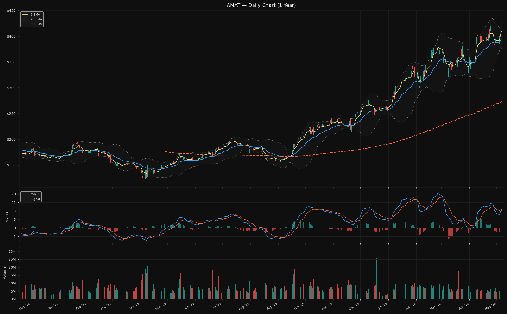

Price $409.82 · 5 EMA $408.74 · 20 EMA $395.25 · 200 MA $273.30
RSI 54.5 (neutral) · MACD: above signal
BB position: 74.1% · ATR $16.04

AMAT's -4.04% drop on May 7 brought it back to its 5 EMA ($408.74) — the stock is sitting right at near-term support with neutral RSI 54.5. This is the cleanest technical setup in the watchlist: above 20 EMA, RSI neutral (not extended), MACD bullish, at the 5 EMA. Today's Seaport initiation at Buy adds fundamental support.

#### Thesis Check
**Status: Watchlist — most actionable setup**

Gross margin 48.7% meets entry condition (>47%). Technical setup is the most constructive in the watchlist. Revenue growth turning positive is the remaining entry condition — earnings next week will provide clarity. Coach signal on semis equipment strength is a direct positive.

**Entry consideration:** Entry here at ~$409 (5 EMA) is within the "acceptable" zone noted in the thesis. The preferred zone is 20 EMA at $395 for better risk/reward. Earnings next week: if revenue guidance turns positive, entry becomes more compelling. The Seaport Buy initiation today is incremental positive confirmation. This is the watchlist name closest to entry conditions being met.

---

### LITE — Lumentum Holdings Inc.
**Technology | Communication Equipment** | Optical components for AI data centre networking

#### Coach Signal
> 「但光模块这边就跌得比较多，像「某光模块龙头」今天都跌破了二十日线，往下看三十日线会不会去摸。」— ZJJ (22:45)

**Signal: Cautious (near-term)**
ZJJ explicitly calls out the optical module sector as the area selling off — "the optical module leader broke its 20-day line, watch whether it goes to touch the 30-day line." LITE as the portfolio's optical module watchlist name is directly referenced by this signal. The 30-day MA is approximately between the 20 EMA ($879) and the 200 MA ($396) on a daily basis.

#### Macro Relevance
Software rotation pulling capital away from optical modules in the near-term. ZJJ says capital will return to AI hardware eventually — but the path goes through the 30-day MA first.

#### Fundamentals
P/E 152x · Fwd P/E 47.8x · Revenue growth +90.1% YoY · Gross margin 40.8%
Analyst target: $1,081 (+25.5% upside) · 24 analysts · Rec: Buy

Revenue growth 90.1% YoY is exceptional. Rothschild Redburn and Craig Hallum are bullish. But gross margin 40.8% remains below the 40%+ expansion trajectory required by the thesis (currently borderline).

#### Technical
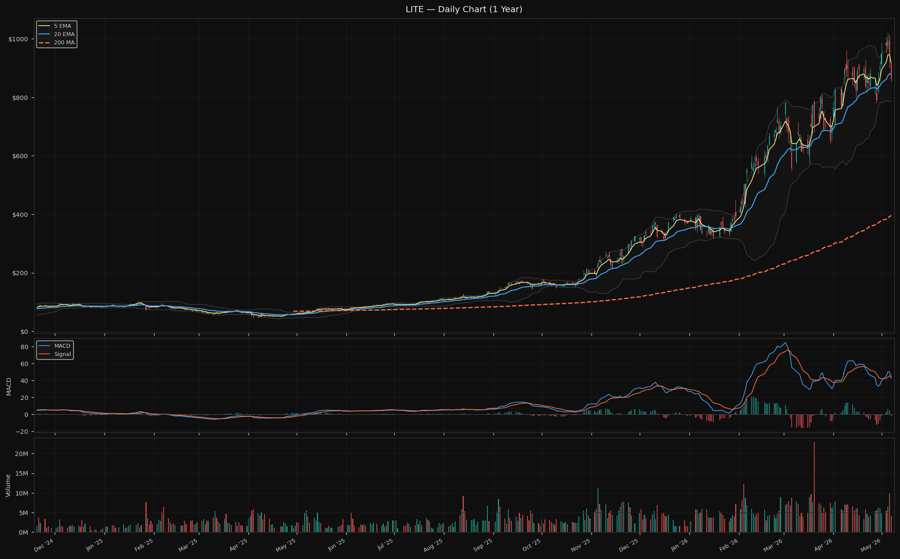

Price $862.25 · 5 EMA $917.49 · 20 EMA $879.03 · 200 MA $395.85
RSI 47.3 (neutral — significantly lower than initial 82.5) · MACD: **bearish cross**
BB position: 38.6% (mid-lower range) · ATR $72.56

RSI has corrected significantly from 82.5 at initial thesis to 47.3 now. Price is -6.0% below 5 EMA and -1.9% below 20 EMA — the "sell the news" post-earnings selling is in progress. This is tracking what the thesis anticipated. The question is whether the 30-day MA (~$857 estimated, between current price and 20 EMA) acts as support or whether the stock continues lower.

#### Thesis Check
**Status: Watchlist — entry conditions partially approaching**

RSI 47.3 is close to the entry threshold of <65 (below 65 is the stated condition, which is now met). The stock is below its 5 EMA (meets the "post-earnings stabilisation" waiting criteria). Gross margin 40.8% is at the lower edge of the thesis entry condition. The bearish MACD cross is a caution.

**Entry consideration:** The post-earnings sell continues. The coach's "30-day MA test" suggests the selling isn't done yet. Entry conditions require RSI to reset below 65 ✓ and price to stabilise above the 5 EMA ✗ (still below). Wait for price to form a base. The $800–$784 (swing low + BB lower) zone is the deeper target if selling continues. Do not enter until there is evidence of stabilisation — a day of high volume followed by close back above the 5 EMA would be the signal.

---

### COHR — Coherent Corp.
**Technology | Scientific & Technical Instruments** | Optical and laser components (AI networking + telecom + industrial)

#### Coach Signal
Same optical module signal as LITE applies. Coach's "光模块龙头跌破二十日线" could reference either LITE or COHR. COHR is the alternative optical play.

**Signal: Cautious (near-term) / Same sector as LITE**

#### Fundamentals
P/E 313x (trailing, EPS depressed) · Fwd P/E 41.3x · Revenue growth +17.5% YoY · Gross margin 36.4%
Analyst target: $355.64 (+10.1% upside) · 21 analysts · Rec: Buy

COHR reported Q3 earnings: revenue beat but stock declined. MS note: "slow margin expansion challenges stock." Stifel and Rosenblatt both raised targets. Gross margin 36.4% is below the 38% entry threshold from the thesis.

#### Technical
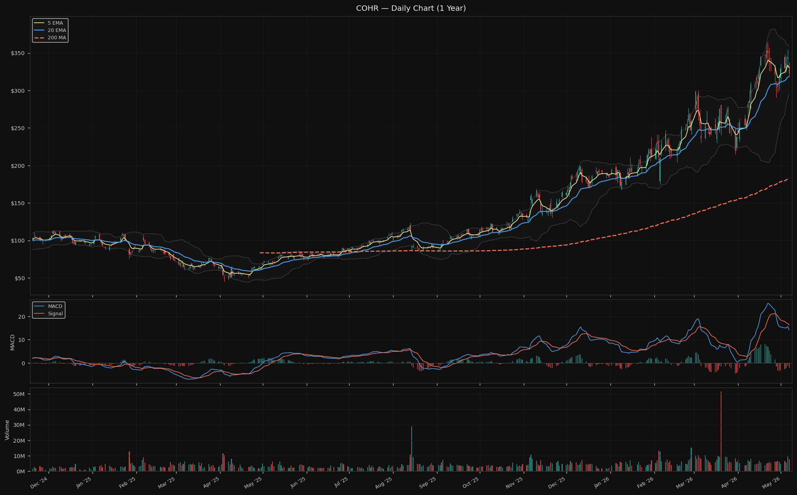

Price $323.28 · 5 EMA $330.24 · 20 EMA $318.52 · 200 MA $183.17
RSI 41.1 (approaching oversold) · MACD: below signal
BB position: 44.1% · ATR $22.87

COHR's RSI has corrected to 41.1 from 75 at initial thesis — a significant normalisation. Price is -2.1% below 5 EMA but 1.5% above 20 EMA. It is in the mid-lower Bollinger Band range with MACD below signal. Less extended than at initial review.

#### Thesis Check
**Status: Watchlist — entry conditions partially met**

RSI 41.1 is well below the 65 entry threshold ✓. However, gross margin 36.4% is still below the 38% entry condition ✗. The "LITE vs COHR decision framework" in the thesis says: if LITE's post-earnings selling accelerates, COHR becomes the preferred optical play. LITE has not broken down catastrophically, so COHR is still in second position.

**Entry consideration:** COHR's RSI reset to 41 is more complete than LITE's. If COHR holds above its 20 EMA ($318.52) on the current pullback while LITE continues lower, the COHR entry moves up the priority list. Wait for gross margin to show improvement above 38% before committing — or for a clear stabilisation signal at the 20 EMA.

---

### AAOI — Applied Optoelectronics, Inc.
**Technology | Communication Equipment** | Optical transceivers (AI data centres)

#### Coach Signal
*Coach guidance does not specifically address AAOI.*

#### Technical Overview
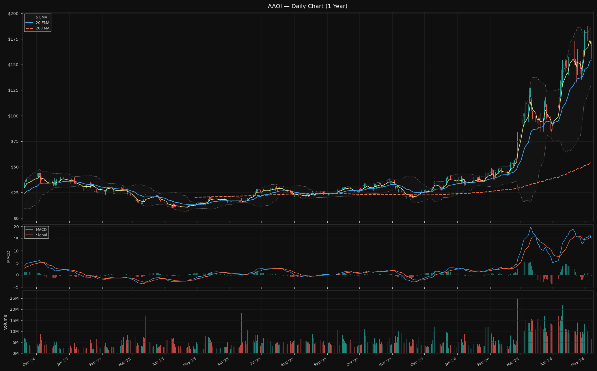

Price $158.38 · 5 EMA $168.61 · 20 EMA $153.92 · 200 MA $54.24
RSI 49.7 (neutral, significantly lower from initial 92.4) · MACD: **bearish cross**
BB position: 51.9% · ATR $19.82

RSI has corrected sharply from 92.4 at initial thesis to 49.7. Bearish MACD cross. Stock is -6.1% below 5 EMA. The Texas manufacturing grant and AI transceiver demand narrative remain in place per recent news coverage.

#### Thesis Check
**Status: Watch only — Q1 earnings the gating event**

"AAOI Stock Before Q1 Earnings: Smart Buy or Risky Move?" is the relevant news headline. The thesis explicitly says: no entry before Q1 earnings. The RSI reset from 92 to 50 is significant and moves the technical setup from "extreme" toward "entry consideration" — but the earnings gate still applies.

**Entry consideration:** RSI reset to 50 means the extension risk has cleared. Still loss-making with 13% short interest. Q1 earnings remains the binary. If earnings show gross margins above 30% and a clear path to profitability, the entry setup (RSI ~50, MACD potentially recovering post-earnings) becomes more interesting. Q1 earnings date: watch for announcement. No entry before that event.

---

## Appendix: Raw Data Reference
- Fundamentals: `data/2026-05-08/fundamentals.json`
- Technical: `data/2026-05-08/technical.json`
- News: `data/2026-05-08/news.json`
- Risk: `data/2026-05-08/risk.json`
- Coach guidance: `data/2026-05-08/coach.txt`
